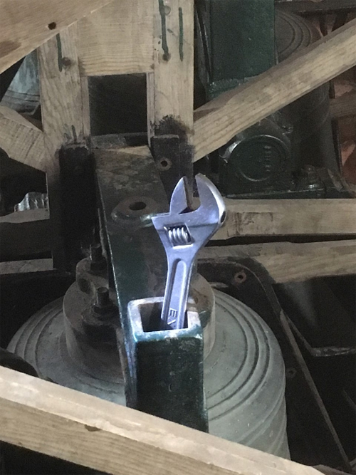

# Belfry Projects

Welcome to *Belfry Projects*! This online document, produced by the Central Council of Church Bell Ringers Stewardship & Management Workgroup, offers advice to anyone who is considering a project to install bells or undertake restoration work on a bell installation in a bell tower. A typical project leader is most likely to be a tower bell ringer, someone responsible for the tower or someone with other interests in bells and bell ringing.

These pages provide: 
  - help in defining the scope of such a project
  - suggestions about how to encourage local and wider interest in the project
  - ideas for how to plan the project
  - advice about the organisations to be consulted
  - an outline of some of the legal requirements
  - suggestions for raising the money required

Every project will be different so there is no one way to approach a bell project. In practice, it is by considering local needs and interests that a project will stand out and be successful.

Some readers may have already had experience in running a bell project. To help those who have not, any constructive comments and examples of completed projects will be most welcome - Contact: smSec@cccbr.org.uk.


The Stewardship & Management Workgroup have produced two other
documents:
 - **[Belfry Upkeep](https://belfryupkeep.cccbr.org.uk/)**, which is aimed at the Steeple Keeper - the one responsible for keeping the bells in order.
 - **[Running a Tower](https://runningatower.cccbr.org.uk/)**, which is aimed at the Tower Captain - the person with overall responsibility for looking after all aspects of a tower.


## Finding Your Way Round

If you are working on a computer browser (or on a tablet in landscape orientation) you will see a navigation menu with links to all the chapters on the left, and a menu with links to sections in the current chapter on the right. On a narrower screen (a phone or a tablet in portrait orientation), you will need to click on the menu icons (three stacked horizontal lines) at the top of the page to see either menu. Another click takes you back to the full text. For those who want to read the document straight through, and to help those reading on small screens, there are links at the end of each chapter to the next and the previous chapter.

## Image Credits

Credits will be found at the end of each chapter. The picture on this page was taken by Sue McClaughry during the work in 2019 to dismantle the bells at St Andrew’s Church, Calstock, Cornwall, as part of the restoration project. Sue was the winner of the 2020 CCCBR Westley Award for Church Bell Maintenance. 


Simon Mellor,  Head of Art at Malvern College prep school in Colwall, drew various sketches during the Great Malvern Priory bell project. With his permission, we have  incorporated five as ‘Title Pictures’ in chapters. We are very grateful to him for this permission.  Simon Mellor retains copyright of the images.

*simon.mellor@thedownsmalvern.org.uk.*


## Acknowledgements

Alison Hodge, Graham John, Allen Nunley, Chris Povey, Robin Shipp.

## Latest Major Changes

| Date | Changes |
| ---- | ---- |
| 09/04/2024 | Getting Specialist Advice: Reference to Clocks Advisers Forum added |
| 02/04/2024 | Project Finance: Added Top Tips from National Churches Trust |
| 16/10/2023 | Project Finance: Now legal for Local Authories in England to provide grants |
| 04/08/2023 | Various chapters: Malvern Priory sketches added |
| 27/07/2023 | Scoping Project and Specialist Services: Added information on peal boards |
| 19/07/2023 | Project Finance: Section added on 'Ringing and Money' |
| 14/07/2023 | Project Finance: More information on VAT |
| 12/07/2023 | Specialist Services: Tower Building Services added |
| 24/06/2023 | Home page: Added links to Belfry Upkeep and Running a Tower |
| 23/06/2023 | Scoping Project: Section added on disabled ringers |
| 05/05/2023 | Launch, all chapters at V1.0 |

----


**[First Chapter](/docs/010-introduction/)**


-----

## Disclaimer

*Whilst every effort has been made to ensure the accuracy of this information, neither contributors nor the Central Council of Church Bell Ringers can accept responsibility for any inaccuracies or for any activities undertaken based on the information provided.*

Version 1.1.1, August 2024

© 2024 Central Council of Church Bell Ringers
