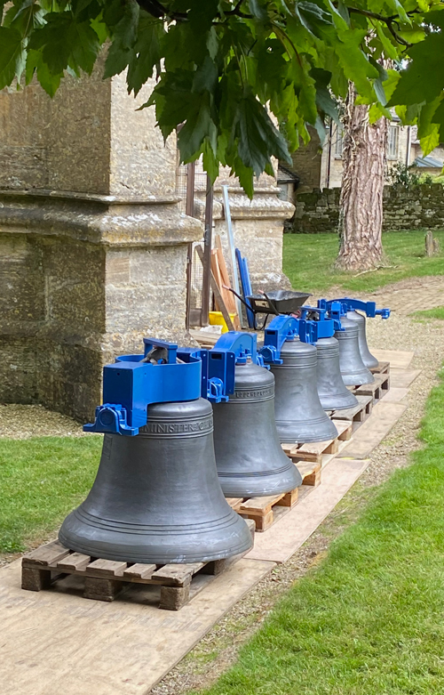
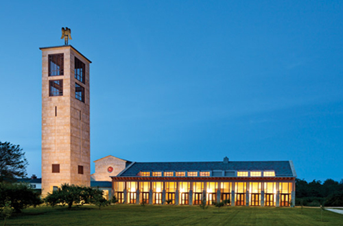
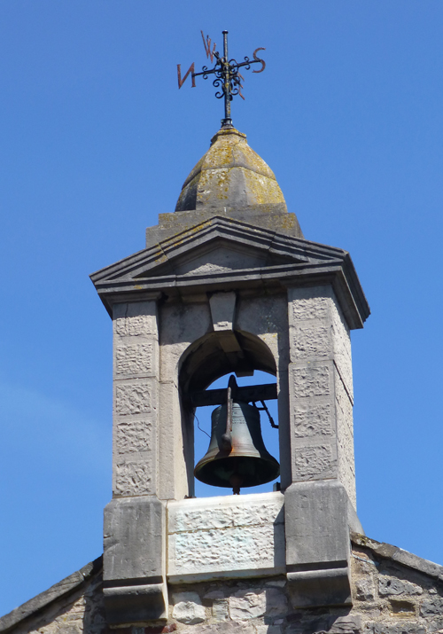

# Introduction


*Bells are often heard but not seen!*


Ringing bells full circle is not just a church activity; it is part of our national heritage. A four hundred year old tradition, it offers challenges and requires skills which most people are able to achieve. Whilst it is based at the parish church and is a part of the worshipping Christian community, a band of ringers is part of the social life of the parish. It brings together people of all ages from all walks of life to participate in an absorbing and fascinating hobby.

A ring of bells will last for many years without major expense, requiring only routine checks and minor maintenance which can be carried out by a suitable experienced Steeple Keeper. Guidance on this can be found in a [companion document](https://belfryupkeep.cccbr.org.uk). In time, however, more major work may be necessary. This will require specialists and contractors, and this document provides advice about how to plan and manage a project involving tower bells and their installation. This is not a technical manual for doing any of the work being considered, even though local volunteers may assist professional bell hangers and other contractors with some of the work.

*Figure 1: Refurbished bells delivered back to the church ready for rehanging*

Figure 1 gives a taste of what might be involved. The ring of 6 bells at Elkstone, Gloucestershire, were taken out by a bell hanger (with volunteer help). They were retuned and new fittings added. Here they are returned to the church ready for rehanging. Two of these bells were cast in 1657.

## For Non-Ringers

Anyone familiar with bell ringing can skip this section but, recognising that this document may be read by non-ringers, the following may be helpful. Further information is given on the website of the [Central Council of Church Bell Ringers](https://cccbr.org.uk/bellringing/what-is-bell-ringing/). A ring of bells installed for full circle change ringing usually comprises between 5 and 12 bells, each weighing several cwt to a ton or more (200kg – 1000kg). The total weight of the bells alone in a tower is therefore considerable. When installed in a tower, the bells together form an integral part of a large musical instrument. Each bell is rung by one ringer in a band.

The sound is not in the form of tunes as from most other musical instruments, but as sequences of mathematical “changes”. Each bell strikes just once as it is rotated one way through a full circle then back again. The installation in the tower therefore has to be substantial enough to withstand the forces imposed as the bells are rotated. 

Bell ringers are members of the local community as bells are rung not just for church events but also to mark local, national and even international occasions. Change ringing has a history of over four hundred years. It offers challenges and requires both physical and mental skills, with insights into complex mathematics, history, engineering, technology, communities and geography. Ringing brings together people of all age groups and with diverse interests – history, travel, mathematics, engineering and – increasingly – computing, to name but a few.

The use of specialist jargon in these notes will be limited but some is unavoidable; this is where ringers and specialists will need to assist.

## Ownership of the Bells

With the exception of a few private rings, the ringers do not ‘own’ the bells. About 90% of bells hung for full-circle ringing are in hung in Church of England churches. Within the Church of England those responsible for the tower and bells are usually the Churchwardens and the Parochial Church Council (PCC). The legal ownership of the bells is vested in the Churchwardens. The PCC has a duty for the use, maintenance and insurance of the bells. 

In other towers, and other jurisdictions, there will usually be what we will term an **Authorising Body** that will have a legal responsibility for the tower and its contents. In such cases, different policies and procedures may have to be adopted and arrangements and permissions must be obtained from the appropriate authorities. Further details are given in the [Belfry Upkeep](https://belfryupkeep.cccbr.org.uk/docs/020-permissions/) document.


**TOP TIP** The Church (usually) owns the tower and bells, not the ringers


## Scope of this Document

### Who may wish to read it

  - Bell ringers considering a restoration project for the bells that they ring.
  - The owner or people responsible for a bell tower - such as church or cathedral clergy, other church workers and volunteers, perhaps with little knowledge of bells and ringing.
  - Third parties with related interests.

It will be the **Authorising Body** and local bell ringers who are most likely to consider the work required and how it can be achieved. For the leader of the project, some knowledge of bell ringing and some engineering or technical knowledge will be helpful, as will experience of organising activities. Planning and undertaking a bell project may seem daunting as few people will have done anything similar before, but a leader with a small team will enjoy working together to achieve a successful outcome.

### How the document may help

There are several circumstances which may result in the need for a project involving a bell installation:

  - The bells have become difficult to ring safely and reliably, limiting the ringing and, more importantly, making it difficult to teach new ringers.
  - A church with no bells hung for full circle ringing may wish to install a full ring as a witness to the life of the church.
  - There may be a wish to augment the number of existing bells. This provides more variety in the ringing (provided, of course, that the tower can raise a capable band).
  - More rarely there may be an ambitious project to install new bells in an existing tower or even in a new purpose designed and constructed tower, as shown in Figure 2.

*Figure 2: Church of the Transfiguration, Orleans, MA 02653 USA – a new church building dedicated in 2000, bells installed 2010*

Each project will be unique, often in a historic building, requiring design work, traditional craft skills, as well as the use of appropriate equipment, tools and facilities. [Specialist advice](../030-specialist-advice/) will be required. There are also [permissions](../080-permissions-approvals/) and [regulations](../100-regulations-compliance/) that need to be considered.

There will be concern about the likely expense. However, [fund raising](../090-project-finance) for bell projects is often very successful, with considerable sums raised by a wide variety of means.

Fund raising and the project itself can also become a focus and stimulus for not just those immediately involved but [many other groups](../060-stakeholder-engagement/) of people locally and further afield.

### Bells not hung for change ringing 

*Figure 3: : Single bell on The Old Town Hall, Denbigh*

Not all bells are hung for full circle change ringing. Some may be a carillon with many bells, a chime of just a few bells, or a single bell, as shown in Figure 3. The technical arrangements of these installations will be different, less demanding structurally for some, but planning and implementing a project will be similar in many respects.

## Other Work in Bell Towers


Usually with the best intentions, some churches may propose work that could adversely affect the installation or ringing of the bells. Ringers should be aware of this.


Occasionally, work is proposed in a tower or church that could affect the bells, their installation or ringing of the bells, even though the main focus of the work is not the bell installation itself. For example, there may be plans to create meeting rooms, kitchen or toilet facilities in the building. Such changes may affect the access to the spaces required by the bell ringers as they ring the bells, and the access to the bell chamber. Even if only rarely required, it must be possible to access and even remove the bells from tower and this is usually only via trap doors in all the floors and ceilings from ground level to the bell chamber.


There are examples of towers where rings of bells are now unusable and inaccessible in towers. For example, a former church is now a pub and the bells are not accessible for ringing. Another church is still open for worship but the tower has been converted to offices with no public access to the bells which remain in situ, and the former ringing room contains equipment.


It is therefore essential that experienced bell ringers contribute advice to make sure that the alterations will not adversely affect routine access and use of the ringing room, the bell chamber or ringing in any way. Bell ringers may also be able to suggest how the project may offer potential for improvements to the ringing environment. 

The best protection against this happening is for the ringers to maintain close liaison with their tower Authorising Body, contributing to any proposals and providing information on the needs of the ringers and the bell installation. Unfortunately, this cannot be the case where the tower has no ringers. This is a difficult situation but ringers at neighbouring towers, with help from the local Guild or Association, may be able to assist.

Further advice can be found [here (PDF)](https://cccbr.org.uk/wp-content/uploads/2020/04/SM_ChurchProjects_2020_Ver_1.pdf).

## Image Credits

| Figure | Details | 
| :---: | --- | 
| Title Picture | St Leonard, Butleigh, Somerset - a typical church tower in which a ring of bells is installed (Photo: Alison Hodge) |
| 1 | Bells at Elkstone, Glos, returned ready for rehanging. (Photo: Simon Ridley) |
| 2 | Church of the Transfiguration, Orleans, MA 02653 USA. (Photo: Blair Tingley) |
| 3 | Single bell on The Old Town Hall, Denbigh. (Photo: Alison Hodge) 

----


**[Next Chapter](../020-scoping-project/)**


----

## Disclaimer
 
*Whilst every effort has been made to ensure the accuracy of this information, neither contributors nor the Central Council of Church Bell Ringers can accept responsibility for any inaccuracies or for any activities undertaken based on the information provided.*

Version 0.1 (UNDER CONSTRUCTION), December 2022

© 2022 Central Council of Church Bell Ringers
