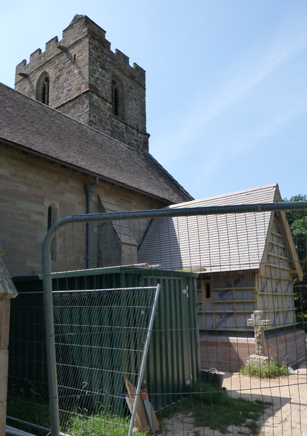
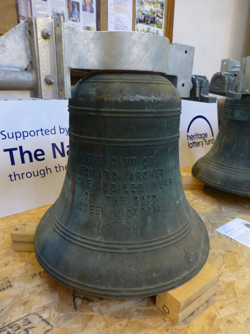
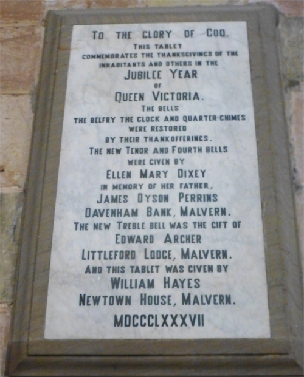
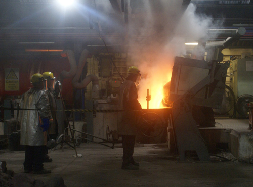
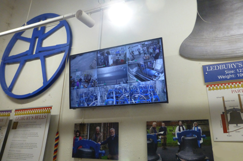
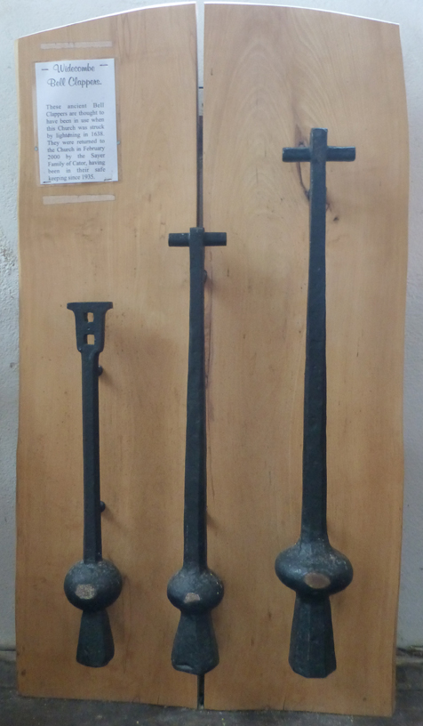

# Scoping the Project


Of the over 7000 rings of bells in the world, around 90% are within the jurisdiction of the Church of England (CoE). We will use terms such as 'incumbent', 'church wardens' and 'Parochial Church Council (PCC)' in this document. We trust you can translate these into the equivalent terms in other jurisdictions.


A bell project may start as the seed of an idea or it may already have been discussed in a committee such as the Parochial Church Council (PCC). This chapter suggests how to develop the initial ideas so that other people may become involved and start to appreciate what may be achieved. This will help the project come to a successful completion. No two projects will be the same so these notes offer guidance that may be considered rather than a step by step guide.

## Inception and Generation of Initial Ideas

### Whose idea is it? 

A project involving tower bells may be proposed by one of several individuals or groups. It may be bell ringers but others such as the incumbent, church members or local parishioners interested in the tower and bells may also have suggestions. They will have various motivations depending on their interests and expectations, views and opinions. 

### Preliminary formalities

Regardless of who suggested the project, ideas should be discussed informally at an early stage with the tower authority, normally the church wardens and PCC for towers within the Church of England. Some Incumbents, church wardens and PCC members will not be familiar with change ringing so it is advisable for ringers to help them understand what is involved in the activity, particularly if there are no bells in the tower or they have not been rung recently. A good way to help people understand is to visit the tower to see any existing installation along with a demonstration of change ringing by the ringers, if it is safe to do so. A visit to other towers to see experienced ringers in action will often be helpful and ringers are usually very willing to demonstrate what is involved - ringing encompasses much more than just pulling a rope or even switching on a switch! Ringers will also offer explanations of the mathematics, engineering, travel, history and team-work that ringing offers. 

The tower authority should appoint a project leader and may suggest team members to help. At this stage there will not be permission to go ahead with the project itself. Further discussions will be necessary at PCC meetings with decisions recorded formally at various stages in PCC minutes. An initial [project team](../050-project-team) will gather information and ideas, then consider what the project could achieve, the benefits for the short, medium and longer term, and how it may be accomplished.

The team should be open to suggestions. Different people with different experiences and views will bring new ideas that should be considered and included for consideration. Support and help will be needed from many others – it should not be a “vanity project” for one or a few people with vested interests!

### Why is the project proposed? 

Bell projects may be proposed for various reasons:
 - improve the mechanical condition of an existing bell installation – often the motivation of change ringers
 - improve safety and the environment for users, including ringers
 - add one or more bells to an existing ring – perhaps the ringers’ idea, but there may be other reasons such as a benevolent donor or legacy for a lasting memorial
 - install a new ring of bells – a tower without any bells? 
 - attract and enthuse new ringers, particularly young people – probably as   part of a larger campaign in the church 
 - make better use of space available and install facilities – toilets, kitchens, meeting rooms, concert venues – a more versatile building
 - welcome new users from the community to the building

... but be cautious! Not everyone will immediately be enthusiastic about the project! Some projects will be highly contentious and it is essential that the needs of ringers are considered alongside those of other users and vice versa. This is particularly important at towers with little or no regular ringing and no local ringers.

 
**TOP TIP**: Aim for many benefits for many people for many years!


### How big will the project be?

Use imagination! Initially, do not worry about practicalities or money – consider what could be done ideally and develop those as the aims. What may be viewed as a large commitment for a small rural parish may be less daunting for a large, high profile parish church or cathedral. No idea is a bad idea, “brainstorm” with others to generate suggestions. It will be easier to attract funds to an ambitious project that meets the aspirations of many, than a small project that satisfies the interests of few. Later it may be necessary to compromise, so separate and develop the ideas later. Remember that the outcomes of bell projects will last for 20, 50, 100 years or more and there will be few opportunities for amendments once the project is complete. 
 - The main focus of the project may be bell related, but a church project may include more extensive work of which the bells are just one part. Although these notes focus on bell projects, bell ringers themselves may benefit from other work that may be included in larger projects. For example, space may be converted to provide more suitable accommodation for a wider cross-section of the local community, with different interests and age groups. Modern designs incorporate level access for wheelchairs and the less mobile, kitchen and toilet facilities (Figure 1) and self-contained meeting rooms of various sizes, that are practical and efficient. For ringers, these may offer facilities for meetings, training and events. 
 - a new ringing room or gallery may enable bell ringers in action to be viewed from the body of the church if a suitable glazed screen is incorporated in the design.
 - the ringing room separated from the body of the church will be easier to heat.
 - a shorter rope length may also help ringing if the draught is excessive (a ceiling height of less than about 12 feet (about 4 metres) is not recommended). 

*Figure 1: Extension under construction at Eastnor, Herefordshire, to accommodate disabled toilet, storage and food servery* 

Consider whether other work should be undertaken at the same time as a bell project. Could scaffold and lifting gear be used for other work around the tower? This may seem more complicated and expensive but for the longer term, it may be more cost-effective overall. What should be done first and what left until later? Remember that work in the tower will inevitably disturb dirt and debris so leave the installation of new and cleaned items until later, if at all possible.


The bell work may be part of a larger programme of work in the church or a more limited project affecting the bells and bell installation alone. Remember that bell installations last for decades and centuries, and there will be few opportunities for major alterations once the project is complete. For a church project, make sure that changes do not limit the scope for further bell related work.

Further information is available [here (PDF)](https://cccbr.org.uk/wp-content/uploads/2020/04/SM_ChurchProjects_2020_Ver_1.pdf).


### When does it need to be finished? 

Is there a date by which the project needs to be completed that will determine the timeline? Can the project be linked with a specific anniversary or event, whether local or national? The Millennium, Royal Jubilee (Figure 2) and Coronation, the end of hostilities during World Wars 1 and 2, and church anniversaries have all been marked by bell projects. Sometimes it is other work that sets the timescale – the demolition of an existing church hall to raise money from a residential development makes alterations in the church a priority. 

*Figure 2: 1887 Victoria Jubilee bell on the floor in Great Malvern Priory, during the project to add 2 bells in 2016*

### Considering risks 

It is equally important to consider risks that may be encountered at each stage in the project; how will they be monitored and how would they be mitigated if they arose. Considering risks is part of [project management](../040-managing-project).

### Specialist advice and information

A lot of advice will be required during the project; information on how and where to obtain specialist advice is offered in the [next chapter](../030-specialist-advice). 

### Other supporting information 

Information and facts, personalities and stories associated with the bells and ringers will be very useful when writing proposals for grants and raising funds. Information will be available in church archives and diocesan records, as well as a public library, county archives and old copies of local newspapers. Members of local history and archaeology groups may have or be willing to assist in gathering information. Local residents, especially those from families who have been in the area for several generations may have their own memoires and records. Memorials and gravestones may suggest who may be able to help (Figure 3).  

*Figure 3: Tablet marking the donation of the Victoria Jubilee bells in Great Malvern Priory*

### Stakeholder views

Even for the smallest project, encourage and involve others – one person cannot think of every possibility. There will be many stakeholders locally and more widely, not all of whom will be known at the start, and some will have views that differ from those more directly involved in the project. The project team should think laterally and take time to “brainstorm” together to identify all possible stakeholders. Invite them to consider and contribute. Ideally identify then contact [appropriate named people](../060-stakeholder-engagement) rather than cold-calling. 

Capture any offers of help as there will be many ways in which volunteers will be able to assist later as members and supporters of the [project team](../050-project-team). Even if people cannot help, they may know others who could have information or who can support. Offers of help may well reduce costs that will be incurred, and those offering will build their own personal experiences or business interests.

### Presentation of outline proposals 

Once the scope of the project has been developed sufficiently, it will be timely to present the project to more people, to gain their interest and ideas. Prepare information about the project using various formats - as talks and presentations, displays, leaflets, podcasts, videos, sketches, diagrams, models, artefacts etc. Various versions will be required for diverse audiences such as young people and school children, neighbours and local residents, local organisations or companies, etc. 

As well as organising special events, take the opportunity to add information to other events and media. For example, parish meetings, church groups and events in the locality. Be imaginative – can historical aspects be presented to primary school children, and scouts and guides? Such events will raise questions and prompt debate – they are all opportunities to recruit potential ringers, encourage support and defuse any concerns. Every event is likely to lead to more ideas and more questions. But be cautious, what may seem to be minor details may stimulate heated debate, such as the colour of a new carpet!

## Refine and Improve the Initial Ideas 

Once initial ideas have been collected, the incumbent and PCC should discuss the project and agree for it to be planned in detail by a [project team](../050-project-team). This will still not include permission to go ahead with the work! 

### The bells and associated installation


This is a summary of the key issues to be addressed. For major projects you should also consult [Technical Options](../070-contract-specification/technical-options/), which is an addendum to *Contract Specification*.


*Figure 4: A new bell being cast by Meighs & Westleys*

 - If new bells (Figure 4) are proposed, then how many, and of what weights? 
 - Is augmentation really needed? 
 - Will the outcome facilitate the attraction, training and retention of ringers? 
 - How big or strong is the tower structure? 
 - Adding 2 bells to a heavier ring of 8 will enable a lighter tuneful 6 to be rung 
 - Explore options carefully, without just jumping to conclusions! 
 - Does the clock use the same bells, is there a chiming mechanism? 
 - Will this be restored or removed as part of the project? 
 - What is to be retained, what should be disposed of, what could be added?
 - What of all the component parts can be retained, repaired, reused elsewhere, recycled?
 - Ease of maintenance should be considered in the design of any substantially altered or completely new installation.

Traditionally, bell frames were located at the level of the louvres. Depending on the design of your tower, it may be possible to locate a new frame lower in the tower. This may have the advantage of reducing the sound level immediately outside the tower and possibly make the bells sound better at a distance. In particular, it should avoid individual bells ‘shouting out’ at certain positions around the tower. If you plan to replace an historic old frame by a modern one, this also gives you the option of retaining the old frame in place. If you decide to follow this option, there are some points you need to consider:
 - The old frame must be stabilised to avoid parts falling off onto the new bells.
 - If the frame is historic, you may have to provide access for inspection and recording – remember that you may not have a solid floor below the old frame.
 - You will also need to have access to the louvres, to check and maintain the grills protecting the tower from access by birds, squirrels and other wildlife.

### Peal Boards
During a restoration project, there may be a need to relocate old peal boards. You may even decide on a new board – perhaps a double one showing the last peal on the old ring and the first after restoration. This will certainly need to be included in the items to be agreed with the tower authority and they must consider whether further permissions are required according to the Church of England Faculty process. Useful advice on this is provided in an article *New peal boards and restorations* in the 30 June 2023 issue of *The Ringing World* (p 675). A list of specialists providing peal boards is included in the [Specialist Services](../115-specialists#peal-boards) chapter.

### What other improvements should be made? 

Before work is underway consider the need for the following:
 - Variable sound control so that neighbours are not disturbed by ringing
 - Improved access to higher levels of the tower and roof, including to enable tower tours
 - Roof or gutter repairs
 - Addition of safety features (e.g. improved staircase, handrails, steps, walk ways and ladders)
 - Weather and bird protection for the tower
 - Sound management externally (for neighbours) and internally for ringers 
 - Security (improved doors and windows, locks, alarms)
 - Electrical supplies, lightning conductor, emergency lighting 
 - Renewal and / or treatment of metal and timberwork in tower 
 - Removal of debris and clutter, unused items such as pipework and cables

As well as ringing the bells, ringers and others will need to access the tower and bells periodically. They will need to check the conditions and undertake routine maintenance, as well as putting on and taking off bell muffles. More rarely, even the bells or larger parts of the installation may need to be removed down through the tower. Access must therefore be left available, from the tower staircase or trap doors.

### Other details to support ringing

The opportunity should be seized to create a better environment for recruiting, teaching and retaining new ringers, and engaging with the wider church and local communities 
 - Training aids for bell ringers (“dumb” bells and / or simulators, ([for example, as at Worcester Cathedral](https://worcesterbells.org.uk/ringing-towers/cathedral-teaching-centre/)) 
 - Decoration of the ringing room
 - Heating and ventilation for ringers
 - Seating
 - Boxes for ringers to stand on
 - CCTV to show the bells while ringing and the ringers in action (Figure 5)

*Figure 5: A multi-channel live display in the ringing room of Ledbury tower that shows various locations inside and outside the tower. Other static display material is mounted alongside in the ringing room* 

 - Intercom for communication (“*the bride has just arrived!*”)
 - Video linking to the church, belfry and ringing room
 - Display of bell related items, both historic and to demonstrate ringing (Figure 6)

*Figure 6: Display of old clappers in Widecombe Church, Devon*

### Accommodating disabled ringers

Considering the physical efforts required in ringing and the restricted access at many towers, it has often been assumed that it is not possible for a disabled person to ring safely. But public attitudes to disability are changing and examples can be found in the wide variety of sports where athletes, possibly with modified equipment, compete at a high level.

The ways in which disabled ringers can be accommodated in existing towers is discussed in [Running a Tower](https://runningatower.cccbr.org.uk/docs/healthsafety/#disabled-ringers). A major project may offer additional possibilities here – for example, incorporating changes to access and the layout of a ringing room that would be difficult and expensive in an existing structure. This might even be a deciding factor in a decision on whether to re-locate the ringing room to a ground floor.

### Practical considerations 

Work in a bell tower inevitably disturbs or creates a considerable amount of dust and debris, some accumulated over decades or centuries. Care must be taken to protect other fabric and fittings in the building during the work, especially those that are fragile or delicate. Items such as memorials, lectern, wood and stonework may need covering. For the most sensitive items like the organ, this may demand a separate contract from an organ builder. 

Doorways, floors and staircases may need to be protected when heavy items are being moved and at points where scaffolding is to be erected. External accesses, storage and workspaces will also have to be planned.

For surplus materials and items generated in the course of the project, plan how they will be reused,  recycled or their disposal.  Some items may be reused as removed from the tower or after being refurbished. Rather than disposing of items, enterprising and creative volunteers may be able turn old timber or metal pieces into souvenirs for sale. Component parts that are no longer serviceable may still be sold and support fund raising. Note that disposal of certain church assets is covered by [Faculty Rules](https://belfryupkeep.cccbr.org.uk/docs/030-faculty-rules).

### Fund raising

The overriding concern for many will be how a bell project can be afforded. In all but exceptional cases, there will be a need to raise money, often what will seem to be quite a substantial sum. The question of money needs to be borne in mind while scoping the project but in a balanced way – not too optimistic or too pessimistic. It is likely to be easier to raise the funds for an ambitious, more costly project with wide community benefits than a smaller scale project only likely to support the few local bell ringers. Be brave and hopeful – the money will come. 

There are a few grant awarding organisations that specialise in supporting bell related project but the majority of charitable funders now expect any project to benefit a wider group of beneficiaries than just bell ringers or even the church alone. 

Potential funders will need to be convinced about who will benefit and how, in the short, medium and longer term. The project needs to be made relevant for a significant part of the local community, interesting and fun! It will be necessary to demonstrate how the work will benefit many people from diverse groups, particularly those who are normally not typically engaged, and last for a long time, years and decades, not just weeks and months. 

Once the scale and approximate cost of the project is known, it will be appropriate to launch a [fund raising](../090-project-finance) campaign.

### Scope creep

While it is appropriate to aim for a project that makes best use of the time and effort that will be devoted to it, be cautious that the scope of the project does not become too ambitious. Play devil’s advocate and challenge carefully additional features that are suggested to ensure that they will add the value anticipated.


**TOP TIP**: Go far and wide, do lots of research to find unexpected opportunities and potential pitfalls.


## Ringing and Ringers While the Project is Underway

If there is an existing band of ringers, consider how they will continue to ring while the bells are out of action. They may be able to support ringing at neighbouring towers and this may be the opportunity for them to experience different numbers and weights of bells. Plan how the ringers will keep in contact with each other and the progress of the project, especially if they are unable to ring elsewhere for some reason. 

If the tower has few or no ringers, how will a new band be recruited and trained as part of the project? Volunteers from nearby towers may help recruit lapsed ringers and prospective ringers.  Willingness, enthusiasm and determination to succeed is required, whether they are regular churchgoers or not. This is covered in the companion document [Running a Tower](https://runningatower.cccbr.org.uk/docs/buildingateam). In addition, [The Association of Ringing Teachers](https://ringingteachers.org/) supports ringing teachers and recruiting new ringers, and the [Central Council of Church Bell Ringers](https://cccbr.org.uk/resources/recruitment-and-retention/) provides some resources for recruiting new ringers. 

The most satisfying thing of all is for your new band to ring at the dedication service.

## Getting Approval and Permission to go Ahead 

Once the scope of the project has been outlined in detail, the Project Leader will finalise the details, and draw up all the documentation. First it will be the tower authorities who will have to give permission for the project to go ahead and they in turn will need to be convinced that all the information required for [higher level approvals](https://belfryupkeep.cccbr.org.uk/docs/020-permissions/) is available.

## Image Credits

| Figure | Details | 
| :---: | --- | 
| 1 | Extension under construction at Eastnor, Herefordshire (Photo: Alison Hodge) |
| 2 | 1887 Victoria jubilee bell on the floor in Great Malvern Priory (Photo: Alison Hodge) |
| 3 | Tablet marking the donation of the Victoria Jubilee bells in Great Malvern Priory (Photo: Alison Hodge) |
| 4 | A new bell being cast at Meighs & Westleys (Photo: Westley Group) |
| 5 | A multi-channel live display in the ringing room of Ledbury tower (Photo: Alison Hodge) |
| 6 | Display of old clappers in Widecombe Church, Devon (Photo: Alison Hodge) |

----


**[Previous Chapter](../010-introduction)** - **[Next Chapter](../030-specialist-advice/)**


----

## Disclaimer
 
*Whilst every effort has been made to ensure the accuracy of this information, neither contributors nor the Central Council of Church Bell Ringers can accept responsibility for any inaccuracies or for any activities undertaken based on the information provided.*

Version 1.1.1, July 2023

© 2023 Central Council of Church Bell Ringers
