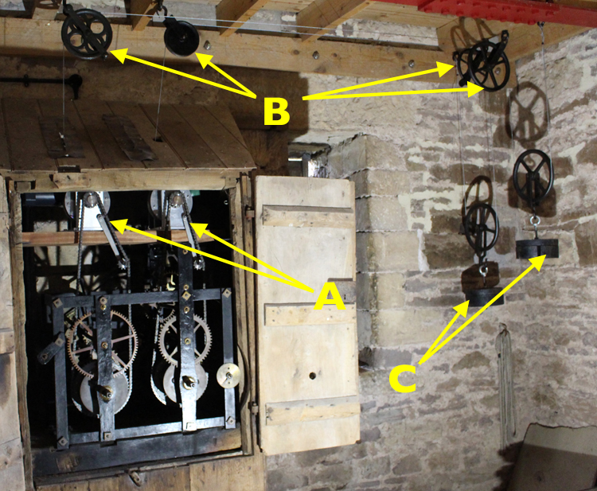
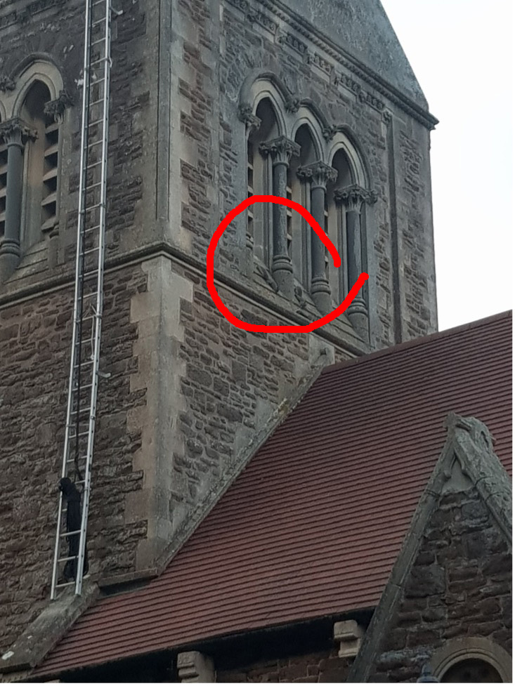
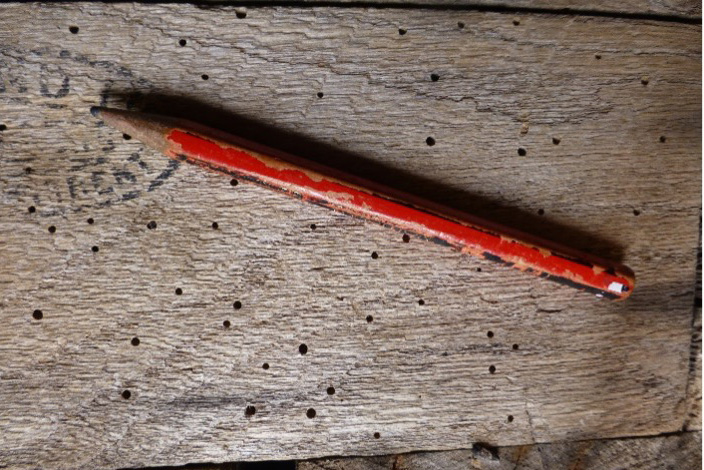

# Getting Specialist Advice

It is only with specialist advice that the full scale and scope of a project is likely to be determined. Every tower and ring of bells is unique so advice on the tower and bell installation will have to relate to each project specifically. 

As with other major projects, many people will be concerned that they do not know where to start, where to obtain advice or even what advice will be needed. Perversely, it is asking questions and finding information that generates more questions and options! Use multiple sources of information and be open minded at the start – do not limit ideas by preconceived expectations about feasibility, funding or other constraints.

## Advice on Bell Installations

If you already have a band of ringers wanting to improve or augment their bells, you should already be in contact with the bell ringing community. This gives you a big head start and much of the information given here may already be familiar to you – although there is always more to learn!

If you have no ringers, maybe no bells in your tower, and perhaps you know little about bell ringing, then you will need to lean heavily on specialist advice. We hope the following will help you.

### Local ringers & ringing societies

Neighbouring towers are a valuable first source of information, particularly if you have little or no knowledge of bell installations. They may provide early thoughts on the scope of your project and they can put you in touch with the wider ringing community.

Most ringing societies are affiliated to the Council of Church Bell Ringers [(CCCBR)](https://cccbr.org.uk/about/members/). Some societies have an appointed ‘Bell Adviser’ (not to be confused with the [Diocesan Bells Adviser](#diocesan-bells-adviser)) and maybe a network of local bell advisers. Whatever the arrangement, the Society should be able to offer informal advice on various aspects of a project. This may include the condition of an existing bell installation, what may be feasible in a project and possible ways to achieve the outcomes. These advisers will have knowledge of likely contractors with experience and knowledge locally or nationally and will usually offer such advice voluntarily and for no more than out of pocket expenses. Any of these who are also employed in the bell or other relevant trades must, of course declare a conflict of interest.

In some instances, local ringers may offer to help undertake minor maintenance that may improve the condition of the installation, even enable bells to be rung as an interim solution while more major work is planned. This minor work may still require [permission](https://belfryupkeep.cccbr.org.uk/docs/020-permissions) before going ahead.

### Diocesan Bells Adviser 

For towers within the Church of England, the permission for anything other than very minor work will involve a [faculty or Archdeacon’s approval](https://belfryupkeep.cccbr.org.uk/docs/030-faculty-rules). Any such permission will be obtained by your church authority (Church Wardens and PCC) but ringers will make an essential contribution. The application is made through your [Diocesan Advisory Committee (DAC)]( https://www.churchofengland.org/resources/churchcare/church-buildings-council/how-we-manage-our-buildings/diocesan-advisory-map). The DAC will have an appointed DAC Bells Adviser who may provide advice informally on the proposed project, usually once the scale and scope are moderately well developed. Their formal role is to advise the Diocesan Advisory Committee, that in turn advises the Chancellor of the Diocese, who will make the ultimate decision on whether the project may go ahead. They may be contacted through the Secretary of the appropriate Diocesan Advisory Committee. Note that they are not permitted to draw up detailed schemes or recommend particular contractors. 

### Bell Hangers & Founders

At some stage you will need to be in contact with bell hangers (who carry out the installation) and, if new bells are required, bell founders (some companies fulfil both functions). 


It would be unusual (but not impossible) for a tower to contact a bell foundry directly, as this will usually be done by the bell hanger.


Contact details for such companies are given in [Specialist Services](../115-specialists).

Companies in the bell trade will provide reports on the condition of any existing bells and the associated installation and provide price estimates for work that they propose. They may suggest other advice needed, such as from structural engineers on the condition of the tower itself:
 - How an existing ring of bells may be restored by relatively minor repairs to or replacement of old, damaged or worn components 
 - More substantial alterations and repairs, perhaps with a new frame to accommodate the addition of one of more new bells
 - A major project to install a new ring of bells in a tower never before used for change ringing

While the input from such companies is valuable and essential, there is a view that they may not appreciate your own particular needs and that you should have a clear view of those needs before contacting such companies.

### Clocks

If your project involves a church clock, particularly one that strikes on the bells, you will need advice from specialist clock companies. Useful background information is also provided in the [Code of Practice](http://www.clocksadvisersforum.uk/assets/files/CofP.pdf) issued by the Clocks Advisers Forum.

If an existing clock is manually wound or strikes at night, then consider extending your project to automating the clock mechanism so that manual winding is no longer required, and adding a mechanism so that it can be silenced at night. Information on both options is included in Sections 07 and 08 of the Clocks Advisers Code of Practice.

Electric winding has a sometimes overlooked advantage over manual winding. With manual winding, a long drop for the weights is needed to avoid frequent winding. With electric winding, the weights drop only a short distance before the mechanism winds them back up. The advantage of this is shown in Figure 1:

*Figure 1: A tower clock modified for electrical winding*

As usual, this clock is situated in the clock room, or intermediate room, between the ringing room and the bell chamber. When it was manually wound, the wires supporting the weights were routed up into the bell chamber, round two sets of pulleys to drop down in the corner of the clock room and into a chute running down into the ringing room. When fully wound, the weights were in the bell chamber to maximise the drop.

There were two disadvantages: (a) for inspection and repair of pulleys, the clock engineer required access to the bell chamber, with very little room to place the ladder needed to reach the pulleys, and (b) the holes needed to accommodate the weights in the bell chamber and intermediate room floors, plus the weight chute, transmitted bell noise into the ringing room.

Figure 1 shows the installation after conversion to electric winding – the motors (in this case two, for the clock and the hour chime) are shown at A. The weight wires pass over pulleys (B) down to the weights (C). The whole installation is now located within the clock room, simplifying maintenance, and the holes in both floors are sealed, cutting down noise in the ringing room.

Clearly, much of this work was carried out by a church clock specialist.

Contact details for companies working on church clocks are given in [Specialist Services](../115-specialists).

### Electrical

The electrical supplies in a tower for lighting and power may be inadequate or not energy efficient. The project may include upgrading of the supplies and this may be essential to enable contractors to use power tools and work safely with adequate lighting during and after project completion. 


Note that the Church of England Faculty Rules limit the contractors who are permitted to work in churches. “For the purposes of Schedule 1 and work to an electrical installation or electrical equipment, “accredited certification scheme” means a scheme of product conformity certification for industrial and commercial electrical work which applies to the work that is to be carried out and which is accredited by the United Kingdom Accreditation Service (UKAS).” In practice, such contractors are likely to be  NAPIT and / or  NICEIC accredited. Note specifically that domestic electrical installers and amateurs are not permitted to work in churches.


Lighting and heating in the Ringing Room are discussed in [Running a Tower](https://runningatower.cccbr.org.uk) and points specific to the Bell Chamber in [Belfry Upkeep](https://belfryupkeep.cccbr.org.uk).

### Noise

Excessive noise levels from the bells within the Ringing Room make it difficult for ringers to hear each other when ringing and above a certain level could damage hearing.

Outside the tower, neighbours may complain, especially if the bells have not been rung for some time or it is a completely new ring of bells. Such complaints could be interpreted by an Environmental Health Officer as causing a nuisance under the Environmental Protection Act 1990.

Sound management is complex and may need more specialist advice than can be provided by the bell hangers, whether internal or external to the tower. Further information is given in this [downloadable PDF](static/Mike-Banks-noise.pdf).

### Sourcing & disposal of materials

New and replacement materials should be sourced responsibly considering environmental and ethical factors. Surplus materials may be sold, made available for reuse, recycled or as a last resort disposed of optimally. Items removed from the original installation should be preserved, see [Historical and Conservation](#historical-and-conservation).

Appropriate arrangements may be set out in the [contract specification](../070-contract-specification). 

### Architects

Projects that are likely to involve changes to the structure of the building will require the services of an architect. Within the Church of England there will usually be a [formally appointed Church Architect]( https://www.churchofengland.org/resources/churchcare/making-changes-your-building-and-churchyard/appoint-architect) who may have to be involved in some tower projects. However, they may not have the specific expertise or experience to undertake all aspects of the proposed project and complementary or supplementary advice may be necessary.

### Structural Engineers

Advice may be necessary on the structural integrity of the tower, and how the bells may affect the tower or vice versa. Some towers experience quite noticeable movement during ringing. This is unlikely to cause damage to the tower but it may result in difficulty in striking the bells well. Some pioneering work was done on this in the 1990s and, more recently, the topic has been revisited, taking advantage of developments in electronic technology. A summary of the current position was published in The Ringing World, Issue 5783, 25 February 2022, pp178-179. This summary is also available as this [downloadable PDF](static/220201-Tower-movement-background-for-RW-Feb-2022-v4.pdf). 

There are very few structural engineers who have a full understanding of the implications of bells being rung full circle on a tower and who could advise on bell projects. Some who are known to undertake contracts associated with bell work are included, without recommendation, in [Specialist Services](../115-specialists).

### Historical and Conservation

Depending on the historical and conservation status of the tower, frame and bells, advice may be needed from various local and national organisations. Some may wish to suggest or even impose certain conditions on specific aspects of the work.  The tower authorities may already be in contact with relevant organisations from previous projects. 

Heritage bodies like [Historic England](https://historicengland.org.uk/advice/caring-for-heritage/places-of-worship/making-changes/advice-by-topic/bell-frames/ ) and amenity societies, for example, [SPAB - Society for the Preservation of Ancient Buildings](https://www.spab.org.uk/ ), will normally need to be consulted as their views may need to be heeded and these will often influence plans and costs.  Whilst their requirements may not be compulsory, the Diocesan Advisory Committee and ultimately the Chancellor of the Diocese will take their views into account. 

[Archaeologists](https://belfryupkeep.cccbr.org.uk/docs/020-permissions/#archaeologically-significant-sites) may be required, especially if ground disturbance is envisaged – such as when a project involves church building works. There are local volunteer groups and county archaeology teams in most areas.

In disposing of items removed during the project, care must be taken to preserve what may be deemed to be historic / heritage or artistic items of interest. In the [Church of England faculty rules](https://belfryupkeep.cccbr.org.uk/docs/030-faculty-rules/), there are repeated references to *sale or other disposal of an article of architectural, archaeological, artistic or historic interest*. Specific requirements may be stipulated in the faculty after consideration of reports from other agencies involved. Even graffiti on stone or woodwork may help shed light on the previous ringers and other users of the church and therefore be considered as of value – and of interest to future generations.


Note that historic information may be a benefit as well as a constraint. Local historians may have information about the history of the church, including any original bells, and this may help to generate interest in your appeal for funds.


### Environmental Considerations


Points covered in this section are an ongoing concern for any tower. They need to be considered as part of a project because:
 - The condition may be particularly bad if the installation has been neglected for many years
 - Removal of material and fittings during a project may offer better access for checks


#### Bats

Bats are a protected species: they and their roosts must not be disturbed. Contractors will advise on the presence of bats, how proposed work could affect them and mitigating actions. Work may need to be timed to minimise risks of disturbance. Advice is available [here]( https://www.bats.org.uk/advice/information-for-places-of-worship).

#### Birds

Birds are protected  in the UK under the [Wildlife and Countryside Act 1981]( https://www.rspb.org.uk/birds-and-wildlife/advice/wildlife-and-the-law/wildlife-and-countryside-act/#:~:text=Basic%20protection,in%20use%20or%20being%20built ). Work will need to be planned around the nesting season if any birds are present in or around the tower.

If birds are already roosting and nesting in the tower, their droppings and nest material will need to be removed before work can commence. If extensive, this is a major operation with possible health hazards which may need to be carried out by a specialist contractor. Advice is available [here](https://belfryupkeep.cccbr.org.uk/docs/040-health-and-safety/avian-flu/). The project will then need to include installing or improving the mesh over louvres and window openings in the tower to remove the risk from birds and their nest material. 

Birds are not always bad. Peregrines nesting on the outside of a tower are a wildlife attraction and may help to keep other birds away. In one tower at least, boxes for [nesting Swifts](https://belfryupkeep.cccbr.org.uk/docs/020-permissions/#protected-wildlife) have been fitted within the louvres but outside the protective netting – a valuable help to a species that is losing many of its traditional nesting places.

#### Grey squirrels, rats and mice 

*Figure 2: Squirrels high up on the tower at Coddington, Herefordshire.*

Grey squirrels may look attractive (Figure 2) but they cause damage within buildings. They can gnaw woodwork, strip insulation from electrical cables and contaminate the area with urine and droppings. They are most likely to gain access to a tower through louvres or broken windows and, as for birds, this must be addressed in your project.

Rates and mice present similar problems but controlling their access may be more difficult. Specialist assistance will be needed if they present a problem.

#### Woodworm and Death Watch Beetle

*Figure 3: Typical woodworm flight holes in timber. These holes appear old – newly made holes that are undisturbed often have the evidence of wood dust alongside.*

Worm or beetle attack (Figure 3) on timber within the tower will require appropriate specialist advice and treatment, even if the timber is not fulfilling a structural function. Professional contractors will need to ensure that their treatments will be suitable considering other species present and the nature of the fabric being treated. 

#### Fungal decay

Wet or dry rot in the tower, if present, will need attention as part of a tower project. A qualified surveyor may be needed to assess the extent of the damage and will recommend treatment, possibly including the removal of affected material. This may require the strengthening of any structural timber, such as support beams or parts of a bell frame. Wet rot is more likely where there are leaks and these must be rectified before further work is carried out.

## Analysing and Using Advice

The information gathered may be complex and even inconsistent, making it difficult to interpret. You need to be aware that some of those offering advice may have their own prejudices or their own interests at heart. You may encounter “instant experts”. 

You will need to understand and balance the information given, particularly where there are conflicts. This is where the support of [team members](../050-project-team) will help. If necessary, ask for additional information and clarification; better to do so at an early stage, as once the project is underway it may be technically or financially difficult to alter. 

## Image Credits

| Figure | Details | 
| :---: | --- | 
| 1 | Tower clock modified for electric winding, Thornbury, South Gloucestershire. (Photo: Robin Shipp) |
| 2 | Squirrels high up on the tower at Coddington, Herefordshire. (Photo: Elizabeth Bowkett) |
| 3 | Woodworm flight holes in timber. (Photo: Alison Hodge) |

----


**[Previous Chapter](../020-scoping-project/)** - **[Next Chapter](../035-permissions-approvals/)**


----

## Disclaimer
 
*Whilst every effort has been made to ensure the accuracy of this information, neither contributors nor the Central Council of Church Bell Ringers can accept responsibility for any inaccuracies or for any activities undertaken based on the information provided.*

Version 1.1.0, April 2024

© 2024 Central Council of Church Bell Ringers
