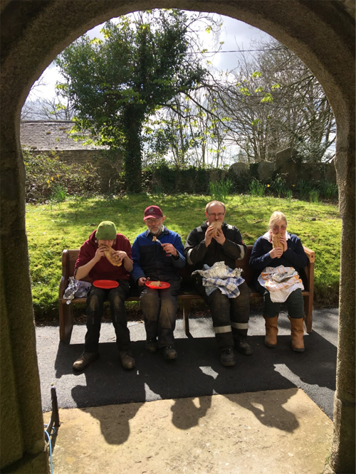

# Project Team

UNDER CONSTRUCTION

A project may be proposed by one or two individuals with ambitions to achieve certain outcomes. However, it is usually better for a small group of people with a wider range of skills, interests and experiences to work together to make the project a success. It is advisable that the project is not the direct responsibility of an existing committee such as the PCC as that will usually have many other commitments and structured ways of operating; the team will need flexibility to plan the work and establish ways of working that will achieve the outcomes intended.

## Appointing the Project Team 

### Project Leader

The tower authority should appoint a project leader. Previous experience of managing projects may be helpful whether professionally or voluntarily but is not essential. Interest, a logical approach plus time available are probably most important. 

Importantly, the leader should be willing to work with others whether volunteers, contractors, those consulted and giving advice, and other stakeholders. The leader need not to be “the best ringer”, tower captain or steeple keeper, but should have some knowledge of ringing and bell installations. 

The leader’s terms of appointment should be agreed ideally in writing, outlining the scope of their responsibilities, what is to be achieved, timescales and any constraints. 

### Team Members

The leader should have the authority to appoint a small team, after consultation with the tower authorities, to assist with various aspects of the project. Team members may be allocated a specific role such as Project Secretary or Treasurer, consistent with their skills, interests and time available. What they agree to do should be set out in writing. Importantly, the team should be able to provide continuity if key individuals are unavailable. 

Offers of help should be valued and accepted but not every volunteer needs to be a full team member, for example, someone may be willing to contribute to a certain activity or for a certain period but not involved otherwise. 

Team members need not all be bell ringers; they may be able to contribute in other ways and will certainly gain new experiences. Volunteers may subsequently become involved in church activities and ringing, having not been involved previously. Young people helping will learn a lot and potentially help their careers!  For those under 18, parental consent is essential. (Link to safeguarding ***)

### Team working

The team should discuss and agree how they intend to operate, share workload and activities, distribute information and maintain records. The team will need to meet periodically to discuss and agree key matters, supplemented by frequent electronic communications. 

As team members get to know each other, they will build a rapport enabling them to work together through the project. There will be high and low points, frustrations and successes; socialising together will help!

### Team Members and Roles

The following are examples of roles that may be required. Note that several roles may be combined or may not be necessary, depending on the scale of the project and interests of those involved. 


<table>
    <thead>
        <tr>
            <th>Role</th>
            <th>Character</th>
            <th>Responsibilities</th>
        </tr>
    </thead>
    <tbody>
        <tr>
            <th>Project Champion</th>
            <td>Visionary, charismatic champion for the project, key influencer, well connected, spokesman</td>
            <td>High profile engagement with local dignitaries, official bodies</td>
        </tr>
        <tr>
            <th>Project Leader</th>
            <td>Determination, completer finisher, planner, team worker, eye for detail</td>
            <td>
                <ul>
                    <li>Coordinate whole project</li>
                    <li>Prepare the project plan and schedule - what happends when, who and how</li>
                    <li>Finalise and proof read contracts prior to sign off</li>
                    <li>Reschedule and record changes, keep everyone informed</li>
                    <li>Identify, log and review risks, update them appropriately</li>
                    <li>Report to church authorities at agreed intervals</li>
                </ul>
            </td>
        </tr>
        <tr>
            <th>Bell and Ringing Advisor / Tower captain (may be two people)</th>
            <td>Bell ringer, engineer, technical knowledge, contract insights</td>
            <td>
                <ul>
                    <li>Provide knowledge and advice on aspects relating to bells and ringing</li>
                    <li>Plan final ring on existing bells</li>
                    <li>Plan first ringing on installed bells</li>
                    <li>Maintain existing band of ringers while tower is inaccessible</li>
                </ul>
            </td>
        </tr>
        <tr>
            <th>Project Treasurer</th>
            <td>
                <ul>
                    <li>Finance / accountancy knowledge</li>
                    <li>VAT, gift aid </li>
                    <li>Listed places of worship exemption</li>
                </ul>
            </td>
            <td>
                <ul>
                    <li>Prepare budget: income, expenditure, contingency</li>
                    <li>Obtain approvals for expenditure</li>
                    <li>Monitor expenditure, compare with budget and income</li>
                    <li>Collect grants</li>
                </ul>
            </td>
        </tr>
        <tr>
            <th>Grant Writer</th>
            <td>Good writing / language skills, meets deadlines</td>
            <td>
                <ul>
                    <li>Identify grant opportunities</li>
                    <li>Research requirements</li>
                    <li>Prepare grant applications</li>
                    <li>Report to grant awarding bodies</li>
                </ul>
            </td>
        </tr>
        <tr>
            <th>Fund Raising Lead</th>
            <td>Local and wider knowledge of opportunities</td>
            <td>
                <ul>
                    <li>Establish fund raising plan and campaign </li>
                    <li>Engage support of fund raisers</li>
                    <li>Lead preparation of fund raising materials</li>
                    <li>Prioritise and coordinate fund raising events </li>
                </ul>
            </td>
        </tr>
        <tr>
            <th>Project Secretary</th>
            <td>Administrator, attention to details</td>
            <td>
                <ul>
                    <li>Coordinate, collate and submit Faculty documents </li>
                    <li>Apply for and manage formal permissions with appropriate authorities </li>
                    <li>Formal meeting minutes and action follow up</li>
                    <li>Records management</li>
                </ul>
            </td>
        </tr>
        <tr>
            <th>Stakeholder relations Lead / Public Relations </th>
            <td>Good communicator, designer, artist, author, social media and web user, charismatic, flair, imagination  </td>
            <td>
                <ul>
                    <li>Frequent formal updates for PCC and church authorities</li>
                    <li>Informative updates for congregation, church magazine, notice boards </li>
                    <li>Press releases</li>
                    <li>Fliers and leaflets</li>
                    <li>Display boards</li>
                    <li>Photographic record </li>
                    <li>Maintain an interesting blog </li>
                    <li>Set up and maintain project website</li>
                </ul>
            </td>
        </tr>
    </tbody>
</table>


## Image Credits

| Figure | Details | 
| :---: | --- | 
| Title Picture | Lunch for bell hangers and volunteers during the project at Calstock, Cornwall – pasties of course! (Photo: Andrew Mills) |
| 1 | Recognition for the project team at Horton Kirby, Kent  (Photo: Nick Wilkins) |

----


**[Previous Chapter](../040-managing-project/)** - **[Next Chapter](../060-stakeholder-engagement/)**


----

## Disclaimer
 
*Whilst every effort has been made to ensure the accuracy of this information, neither contributors nor the Central Council of Church Bell Ringers can accept responsibility for any inaccuracies or for any activities undertaken based on the information provided.*

Version 0.1 (Under construction), January 2023

© 2023 Central Council of Church Bell Ringers
