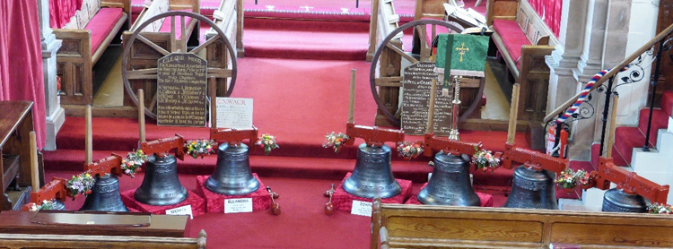

# Stakeholder Engagement

UNDER CONSTRUCTION

Bell ringers are likely to understand the reasons for a bell project but others may have little understanding of the justification for the project and expense, or even have much knowledge of bells and bell ringing. The image of monks and choir boys swinging on bell ropes as depicted on Christmas cards, is pervasive but misleading. 

The project team therefore will explain the reasons for the project, how it will contribute to the life of the church and the whole community, not just a few bell ringers! As well as being factual, it will be necessary to inspire and enthuse people. 

Some stakeholders may also be willing to donate money towards the project. This should not be the only purpose of engaging with them and will not be the focus of this chapter. That is dealt with [later](https://belfryprojects.cccbr.org.uk/docs/090-project-finance/#raising-money).

This chapter provides a general description of stakeholder engagement. An [Annexe](../060-stakeholder-engagement/engagement-ideas/) provides more detailed ideas which you might also want to consider.

## Who are Stakeholders?

Anyone with a potential interest or reason to know about the project. The team may identify stakeholders by thinking logically but also laterally in “brain storming” sessions. 

 - **Owners and those responsible for the bells and tower** – since about 90% of bells hung for change ringing are in Church of England churches  , this will be the church incumbent, PCC, church wardens, plus the relevant Diocesan advisers and authorities. Other jurisdictions will have similar arrangements. This is discussed further [here](https://belfryprojects.cccbr.org.uk/docs/035-permissions-approvals). 
 - **Users** - primarily bell ringers from the tower and local area who will ring the bells for services and practices, and other specific events such as baptisms, weddings, funerals and memorial services at the church. Increasingly, there are requests for bells to be rung to mark local and national events and occasions, such as fetes, new year and royal occasions. 
 - **Parishioners, neighbours and wider local communities** in the parish, town or village, particularly those within audible range - local residents, schools, colleges, workplaces, public bodies, local clubs, societies and charities. Also like-minded individuals and groups, historians, archaeologists, family history groups … 
 - **Local and regional authorities** – many churches are listed buildings. Increasingly, churches are offering a range of diverse services in the local community. 
 - **Other members of the public** – those who may benefit from the project or have an interest.  This could include people and groups locally and more widely, even internationally. For example, individuals and families who may have had connections with the church, village or town, but have since moved away. Many people associate bells with weddings and funerals. Some families may even have relatives who were associated with previous bell project so may be supportive of the project proposed. Involve them early as this could reduce the risks of misunderstanding or objections later. 
 - **Suppliers and contractors** – A bell hanging company may be a prime contractor but with sub-contractors or suppliers of goods and services - structural engineers, electrical contractors, carpentry, painting, etc. This is discussed further [here](https://belfryprojects.cccbr.org.uk/docs/070-contract-specification).
 - **Special Interest groups** – locally and elsewhere. For example, historians, heritage bodies and conservation authorities. 
 - **Donors** – funds towards the project, either in cash or in kind; individuals, charities, government agencies, local groups, businesses …

Involve stakeholders as fully as possible, not just a source of money or suppliers of the work!


**TOP TIP**: Get all stakeholders engaged, enthused and involved. Use their skills and contacts.


## When to Involve Stakeholders 

Stakeholders are involved at various stages during planning and decision-making so that they are aware of aspects that may affect them or be of interest. Some will be engaged just once, some more frequently. Plan carefully when to engage with them at key times so that that they can make timely contributions.

### Initial consultation

At the early stages, key members of the tower and church are likely to be involved and they will help shape the project. Accept suggestions and discuss what could be included as the views of others may identify where there will be further support or challenges. Some people will have very detailed questions while others may be more general. 

Once the plans become clearer, then it is appropriate to raise further interest in the project more widely. Avoid starting too early as partially developed ideas may give the impression that the project is risky or poorly managed so some people will be unsupportive or even oppose it. 

### Formal project launch 

With approval from the authorities, a major event can be held to launch the project. This typically aims to raise its profile of the project as well as start significant fund raising. Usually there will be a function, typically in the church concerned or nearby. Other events will usually be held at about the same time, each tailored to suit a specific audience. Involving high profile influential dignitaries at a launch helps to create an impact.

The project is likely to be launched before the faculty and other approvals are received so it should be made clear that any work will be dependent on final approvals granted. 

### Events

Events take a lot of planning, hard work and effort and do not necessarily raise income in proportion. You may find, however, that organising and participating in events has a beneficial effect in terms of publicity and motivation that outweighs financial rewards. Details are given in the [Appendix](../060-stakeholder-engagement/engagement-ideas/). 

###   Marking key points

Once the project is underway, the project will reach particular milestones and these will be opportunities to update stakeholders – and to celebrate. These may coincide with receipt of specific approvals such as the faculty, when significant sums of money have been raised, or when phases of the work begin or are completed.  

Keeping stakeholders aware of progress is an important part of any project. Consider when certain groups may wish to know when certain activities will occur, for example, neighbours will want to be know when work will start as there may be some congestion around the tower with additional vehicles, even necessitating road closures for short periods, noise being generated by equipment etc. Similarly, alerting neighbours when the bells will start ringing perhaps after a long period of silence.   

### Dedication and blessing of the bells

It is customary for the bells to be blessed prior to them being (re)installed in the tower. This is an ideal opportunity to involve stakeholders, particularly those who have made major contributions or offered assistance in kind. Since bells are not usually visible after installation, the ideal opportunity for a blessing and dedication service will be when the bells have been delivered from the foundry and are in the church yard or on the church floor prior to being hoisted into the tower. If the bells are not to be removed from the belfry during the project, there may still be a rededication service with CCTV used to enable the bells to be seen. 

*Figure ??:  A new ring of 8 bells, delivered and ready to be installed*

While it is wonderful if a senior person such as the Bishop will officiate, fixing a date in their busy schedule will need to be planned well in advance. Whatever is planned, this service will be a good opportunity to invite all the stakeholders and to make it a great occasion. 

### Project completion and celebration 

This is likely to involve a service and more extended event at the culmination of the project. The date chosen will aim to include appropriate stakeholders, including those who have had input into the project such as donors, workers on the project, both voluntary local labour and bell foundry/bell hanger workers, church officers and, of course, local bellringers and representatives of the local Guild or Association. Invite representatives from local organisations such as schools and businesses, Councillors, as well as nearby residents even if they aren’t churchgoers or haven’t been involved in the project. The understanding and forbearance of local residents will be very important during the training of new ringers, even if there is appropriate sound control. With the formal reopening of the tower, allow plenty of time for the first touches by carefully selected bands of ringers, followed by open ringing. Consider carefully who will ring the first quarter peal and peal on the bells. 

The event may include refreshments and reception either in the church or at a nearby hall to include all those involved in the project and allow formal thanks to be expressed. The attendance of the local press and the taking of photographs will help maintain the project in the public eye. Such events are opportunities to engage with people who may express interest and could be attracted to learn to ring. Look out especially for comments such as “*I used to ring…*” from lapsed ringers – they will soon remember how to ring, even if nervous at first! 

### After completion

When all the hard work (and fun) is complete, do not underestimate the task of making the best use of your new ring of bells: re-establishing the band, teaching new ringers and fulfilling a programme of ringing for church and important national events. You may find it useful to keep in touch with some of the stakeholders you have met during the project – they may be able to assist you in the development of your band.

Finally, there is likely to be a succession of requests by visiting bands to ring on the new or restored bells so consider these carefully so that there is not too much disturbance for neighbours and that a quarter peal does not pre-empt the first one planned for your own band! 

## Ideas for Engagement

That completes a general description of stakeholder engagement. The [Annexe](../060-stakeholder-engagement/engagement-ideas/) to this chapter provides more detailed ideas which you might want to consider.

## Image Credits

| Figure | Details | 
| :---: | --- | 
| ?? | The new ring of 8 bells in St Bridget's Church, Moresby, on 13th July, 2018. (Photo: Ron East, Carlisle Diocesan Bell Adviser) |

----


**[Previous Chapter](../050-project-team/)** - **[Next Chapter](../070-contract-specification/)**


----

## Disclaimer
 
*Whilst every effort has been made to ensure the accuracy of this information, neither contributors nor the Central Council of Church Bell Ringers can accept responsibility for any inaccuracies or for any activities undertaken based on the information provided.*

Version 0.1 (Under construction), April 2023

© 2023 Central Council of Church Bell Ringers
