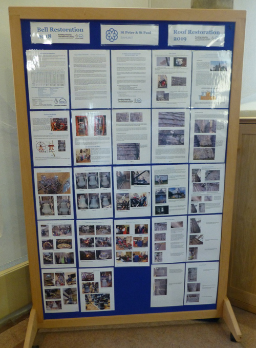
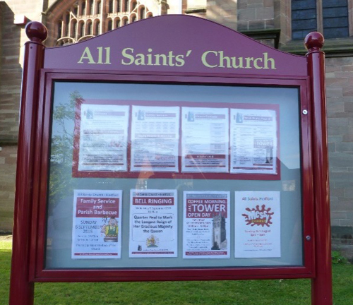

# Ideas for Stakeholder Engagement

UNDER CONSTRUCTION

## General Points

 - Consider how to reach out to different groups, particularly those not normally involved in church activities, using various aspect of the project that will be relevant to different groups. 
 - The project launch will provide the stimulus for preparation of a set of materials that can be used subsequently at other events during the life of the project. 
 - Prepare information using various formats for talks and presentations, displays, leaflets, podcasts, videos, sketches, diagrams, models, artefacts etc. Versions will need to be adjusted to suit different audiences and time available – consider young people and school children, neighbours and local residents, local organisations and companies, etc. 
 - Design the information so that it will not need updating too frequently but make sure that it is kept up to date. Involve someone with artistic flair while making the information accurate and realistic, with a range of users in mind. 
 - Early in a project, develop a style that will be used throughout. This may be based on an existing style used by the church but probably customised specifically for the bells project. Consistent use of colour and a logo help to reinforce the messages about the project, make it “eye catching” and memorable.  Moderate use of colour and an “open” layout rather than dense typescript, aids readability. Pictures, diagrams, charts and tables all help readers to understand what is presented and feel that they wish to participate.
 - With any information indicate how donations may be made to the project fund: bank details, address for cheques, or electronic links. 
 - Invite people to become involved in the project and, maybe, learn to ring.

## What to Include

The content will include key facts about the project, the current situation, the aims, timescales, what will be involved, the people involved, and why the project is needed. Most importantly, indicate the benefits for various stakeholders. Include plenty of pictures, links to videos, as well as technical details such as plans and designs for the proposed work. Show pictures of existing bells, perhaps with indications of current problems, then with examples to show what is envisaged.  Indicate the costs of parts of the work to add some reality.  Put the project in context for each stakeholder from their viewpoint – benefits, history, personal connections, facilities, landmark events. Look for ideas from similar projects elsewhere, but every project is unique so show it as such. Remember that people will want to see how the project relates to them as individuals.


When incorporating information, respect copyright and make sure you have permission to use the material. Acknowledge sources and dates when accessed. Any people included in images must give their agreement - parental agreement for under 18s.


Ask someone else, with an eye for detail, to read and correct information before it is published.


**TOP TIP** Explain the benefits for each stakeholder. Why should they be involved? Analyse carefully and have responses for "naysayers".


## Specific Means of Communication

Build a contacts list and use this to provide updates at appropriate intervals to key stakeholders, typically by email. 

### Letters

In the course of a major project, letters will need to be written, some more formal, some informal. A covering letter will normally accompany forms such as applications for permission, and requests for funds. Even in the days of electronic media, a written letter, possibly handwritten, can make a better and lasting impression. It is advisable to adopt a more traditional style and ensure accuracy, with a neat and tidy appearance. Although spelling mistakes and small errors may not concern some readers, they will irritate others and could lead to an adverse response. Even if sent as an electronic attachment, care and attention to detail is advisable. Letters will probably be accompanied by other information and this too should be of high quality. 

Similar information may be included in several letters but customise each letter carefully for each recipient. Make every letter personal to the recipient as that shows that they are respected and that the focus is on their interests and needs. Avoid addressing letters with “Dear Sir / Madam”: address them to a named individual with their position and credentials.

### Presentations 

There will be many opportunities to present information about the project. Prepare a set of “slides” for projection (typically using “PowerPoint”® software) that includes the key information about the project but adapt this to suit each event, considering the time that will be available and the likely audience. 

Preparing displays and presentations benefits from teamwork – someone with artistic flair may provide the design while others provide more of the content for inclusion.  

Demonstrations of handbell ringing, with tunes or change ringing, are also engaging and there are local groups in most areas.

### Portable artefacts 

A collection of portable artefacts will help audiences understand and reinforce memories. Local bellringers may have suitable items to loan – such as bell models, small bells, broken and worn parts from a bell installation. 

### Website and social media

A good website is undoubtedly essential and can be referenced by other media. The website may be hosted as part the church website and should include useful links to other websites such as those for the local ringers society.  Information may be presented in charts, tables, diagrams and with plenty of pictures rather than long text. Digital presentation of information is becoming more widely used now and useful information is provided [here](https://www.culturehive.co.uk/digital-heritage-hub/).

The design should be clear and suitable for those who may not have the best vision. Check that the website displays as intended on a PC, tablet or mobile phone. With electronic media, the information is available globally so consider readers wherever they may be – local, national and international. 

The website needs to be updated frequently. Consider the focus of the readership – one section may be for existing bell ringers, other areas for children and young people, and another for potential donors and stakeholders. Not every reader will be familiar with bell ringing jargon, so be cautious to explain the terminology and keep specialist and technical content as supplementary information for just those interested. 

Web analytics can be used by the project team to see what pages are being opened (or not), or for only a very short time, so that amendments may be made to ensure that viewers do find the key information. 

Remember to ask a few friends (including non-ringers) to review the website before it is made available openly, to make sure that it explains the project, and answers potential questions. 

Possible online examples are:

 - [Barrow Bells](http://www.barrowbells.org.uk/StJames_restoration.html)
 - [Ledbury Bells](https://www.ledburybells.co.uk)
 - [Little Horwood Bells](https://littlehorwoodbells.co.uk)
 - [St Mary's Lytchett Matravers](https://www.smlm.co.uk/bell_restoration_project/)
 - [Eastnor Church](https://www.eastnorchurch.org.uk/activities/)
 - [Ewhurst Bells Restoration](https://www.friendsofewhurstchurch.com/bells)

### Newsletters and blogs 

These are a good way to share progress of the project, with a blog being part of the website. Pictures are ideal alongside brief text. Out of date information creates a poor impression so even when there is little to report, use the opportunity to add comments about the ringers who may be practicing elsewhere, bells and ringing nationally, the history, mathematics and so on. The [Calstock Bell Ringers](https://www.calstockbellringers.com/blog) provide a good example.

### Leaflets

Even with the widespread use of electronic media, some printed material will still be useful and remain of value to those who are less inclined to use IT. Small leaflets are useful to hand to people at events, for people to pick up from strategic locations and even distribution in the local area. Single sheets of A4 paper folded into 2 or 3 may be a suitable format and cost effective to produce. The contents might include:

 - An illustration of the church or its bells installation
 - A message from a public figure, e.g. the bishop or the mayor
 - A history of the bells and mention of historic occasions when they would have been rung
 - Why a restoration is needed and what it is planned 
 - How local people have been involved in the past
 - How people can be involved in future
 - A brief description of full circle ringing
 - A link for donations, ideally with Gift-Aid options
 - Links to websites that give more information

Include the church Charity Registration number (USA 501(C) in the USA), if appropriate.

Consider where the leaflets will be seen by people who may be interested. They may be left (with appropriate permission) in the church, tourist locations, hotels and B&Bs, Tourist Information Centre, shops, community centres, libraries, businesses and so on.

### Souvenir booklets

For more major projects, a more comprehensive high quality glossy brochure, booklet or book may be prepared about the project – the bells, their history, bell ringing and coupling these topics with local history, church history. With careful budgeting, these may be sold and contribute to fund raising. A second version, or addendum, may be created as a record of the project. Production of such a book, booklet or brochure is probably best suited to someone with the interest and time to commit to it (Figure x).

*Figure x: Booklet celbrating a bells project*

### Posters

Eye-catching posters will be needed for specific events during the course of the project and they will need to be distributed widely. Think laterally about how they may be distributed – ask friends and family, dog walkers, parish magazine distributors etc to pin them up, with permission. If they are likely to get wet while on display, then they should be laminated but they may still need to be replaced so they remain fresh and readable. Display them where there will be plenty of people passing who will see them. 

### Displays and exhibitions 

A display in the church will be essential. Include plenty of photographs and a brief description of the project. A working model bell is always popular and helpful! Other artefacts, perhaps worn out or broken parts can also be used to explain what will be involved in the project. 

Keep the exhibition in a prominent place and ideally make it portable so that it can be taken  elsewhere, perhaps to schools and colleges, shops and other public places. (But not so portable that valuable items may be misappropriated!) 

Some local bell ringing societies have ready-made display boards about bells and bell ringing that is available for loan. These boards may be supplemented by information specific to the project concerned. An example is provided by The Surrey Association [display boards](https://www.surreybellringers.org.uk/resources/display-boards/).

Rigid display boards (Figure y) can be cumbersome to transport and erect so compact and portable “pull up” display panels are often now preferable. Once designed, they are produced readily at low cost by local printers or online suppliers. 

*Figure y: A rigid display board*

“Pull up” banners roll down into the base stand when not in use and can be supplied with a carrying case. Being light weight, they are not well suited to longer term use outside. 

### Local press, radio and TV 

Contact  a presenter or editor who may have specific interest in the project. Keep in contact with them and update them at intervals. The media will want to present unusual and interesting, people centred stories, ideally with plenty of illustrations. They may be less interested in the precise details of the project and will be unlikely to have much understanding of bellringing!

Press releases should be prepared in such a form that that can be used as provided. Don’t leak information before timed press releases, and always respect confidentialities. 

The press and media may wish to interview enthusiastic members of the project team. Give an interview ideally on site to introduce the project. Consider invitations at key times such as when bells are being removed from the tower and loaded onto a lorry for return to the bell foundry or, similarly, as bells arrive back from the foundry, or new bells are delivered. Photos and interviews with new ringers being trained, are always welcomed as people centred stories by the media. Indicate how other aspects of the project may be of interest for their viewers, readers and listeners – history, antiquity, music, maths etc, and how people can get involved.

Be prepared for the media to contact members of the project team at short notice – never miss an opportunity to respond positively! 

### Ambassadors 

Aim to help others to help the project team! Ambassadors are those who are not directly involved in the bells project but engage with it enthusiastically and in turn, help raise its profile. They may help distribute information and encourage people to come to events – people who would not otherwise have become involved.  

## Events
 
Events serve various purposes at various specific stages during the project. What events will be appropriate will depend on the locality and nature of the area. What can be achieved and how in a small rural community will be very different from a large urban area or city. It is important to agree the primary aim for each event and plan for each specifically.  Some will primarily be to raise money and others to engage with the community or recruit new ringers. Some will be themed around the bells and tower with the aim of engaging stakeholders, generating interest and awareness often with people who would otherwise not be involved. 

Consider and agree the main focus of each event proposed. For events that are primarily money raisers, direct the greatest effort and resources into activities that will generate the largest sums.  Sponsored walks, runs and other personal and group challenges remain popular and need not be organised by the fund raising team. Similarly, talented musicians in the community may be willing to organise and present a concert with proceeds donated to the bell fund. 

Aim to engage with people who would probably not otherwise be involved with the church or bell ringing. Look for opportunities to participate in events organised by others to raise the profile of the project, perhaps through a display or short presentation about it. Use such events for their value in raising the profile of the project as much or more than raising money. 

International visitors may be attracted to events. They are often fascinated by English style ringing as it is so different from anything that they may experience at home.

As well as organising the events, it should be possible to participate in activities or events that are organised by others and promoted widely – these could include Diocesan events, local community activities or nationwide schemes such as Heritage Open Days. These local and national occasions will bring the project, bells and bell ringing to the attention of those who would never attend an event specifically associated with bells or ringing. 

Be imaginative – can the history of the bells be explained to primary school children, youth groups such as scouts and guides? Follow these by visits to the tower or other rings of bells. Events will raise questions and prompt debate – they are all opportunities to recruit potential ringers, encourage support and defuse any concerns. Every event is likely to lead to questions so be prepared to answer questions. 

### Suggestions for events

*Figure zz: Open day advertised on church notice board*

 - Tower open days and tours (Figure z) - If the church already has bells that are ringable, then exploit these as both a visible and audible attraction, an opportunity to meet and talk with ringers. Many visitors will welcome the opportunity to go to the top of the tower and look over the neighbourhood. A modest charge will contribute to the project funds.  Check the church insurance cover and complete a specific risk assessment. Some useful guidance is [here](https://www.ecclesiastical.com/risk-management/tower-tours/?gclid=Cj0KCQjwi46iBhDyARIsAE3nVraNVm8v-num9N5c9MaD0FfXmuZUp5sJI6PjYAeZt7d3LEl4oqyUP2saAl8nEALw_wcB).
 - Arrange for a local venue to be open for a function, perhaps one that people cannot normally visit, such as a house or garden, company or historical site. 
 - Involve the support of a VIP – someone who everyone would like to meet! 
 - Exploit any local twinning arrangements when overseas visitors are in your area.
 - Hold demonstrations of ringing and, with suitable precautions, set up sessions for people to “*have a go at bell ringing*” 
 - Exploit church connections with large local families – did some emigrate and still feel a connection with the area – invite them back or ask them to support the project?  
 - Include displays about bell ringing and the project at church events – harvest, Remembrance (are any ringers recorded on the local war memorial?), Christmas, Easter, Festivals, organ recitals, handbell concerts etc, guided tours of the church yard and neighbourhood, special services, 
 - Arrange guided walks to places of local historical interest, liaise with local history / archaeology groups and other societies with special interests such as (in the UK) U3A and WI.
 - You may be able to link with other local events, for example an Open Gardens Weekend.  Remember that the sale of refreshments may encourage visitors and contribute a small profit.
 - Events may be an opportunity to identify lapsed ringers locally, or capture new ringers.
 - Organise visits to the bell foundry to see bells being cast and all the other unique work associated with the manufacture and assembly of bell frames and fittings. 

### Organising an event 

 - Plan well ahead for any event, ideally with people who are accustomed to managing events in the venue that is chosen. 
 - Compile a checklist of things to be done, who is doing them and when.
 - There are many details that are easily overlooked! Useful hints are offered [here](https://www.gov.uk/government/publications/can-do-guide-for-organisers-of-voluntary-events/the-can-do-guide-to-organising-and-running-voluntary-and-community-events).

### Venues 

For a bell project, the church may be appropriate, but consider whether the church is really the best venue for the type of event being planned. Would another venue be more practical? Some people not accustomed to entering churches may be more comfortable being invited to a community hall rather than the church. Some considerations to think about:

 - Does it have space of about the right size?
 - Are there facilities for displays, presentations, refreshments and so on?
 - What about parking, heating and toilets?

### Who to invite

For each event, involve specific stakeholders who are well matched with the purpose of the event. It is likely to be more effective to hold several smaller focused events, rather than attempting to address all interests in one large gathering. For example, events for school children and teachers can be used to explain ringing, its history, the techniques used, the music and the mathematics. Give children a small gift to mark their visit – such as a branded pencil or similar. 

Other events can be for local businesses and dignitaries who may be able to support the project by cash or in kind donations. Local press and media representatives can be invited. Church and community members, are more likely to be interested if the events have a social character as well as more formal basis. Ringers from the local and wider area, will often be keen to visit for example for the “*last ring on the old bells*”. Aim that key people will become ambassadors for the project! 

Invitations need to include a short introduction to the project and the event so that they know what to expect. Invitations need to be customised for each individual, so that aspects of the project will appeal to them. For example  history, young people, traditional skills, music, engineering, architecture; the list could go on. 

### Publicity

Publicise events as widely as possible and well in advance, with reminders leading up to the event. What aspects of the event will attract those to be involved? 

## After the Event

Events take a lot of work: remember that both preparation and clearing up afterwards take far more time than the event itself! 

## Image Credits

| Figure | Details | 
| :---: | --- | 
| xx | Booklet celebrating the completion of the Ledbury Bells Project. (Photo: Alison Hodge) |
| yy | Rigid Display Panel. (Photo: Alison Hodge) |
| zz | Open day advertised on church notice board. (Photo: Alison Hodge) |

---


**[Back to Stakeholder Engagement](../../060-stakeholder-engagement)**


---

## Disclaimer
 
*Whilst every effort has been made to ensure the accuracy of this information, neither contributors nor the Central Council of Church Bell Ringers can accept responsibility for any inaccuracies or for any activities undertaken based on the information provided.*

Version 0.1 (Under construction), April 2023

© 2023 Central Council of Church Bell Ringers
