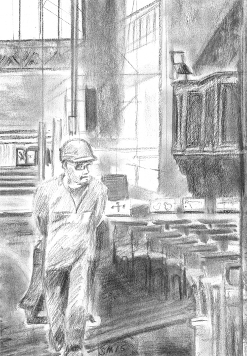

# Contract Specification

Setting out what is to be done in the contract is critical. This defines (a) what is to be done by contractor(s) and (b) the expected outcome of the project. Once the contract is placed, changes may be difficult to make, whether for reasons of practicality or cost. The outcomes of bell projects are normally expected to last for a very long time, decades if not centuries, so it is essential to make sure that the contract is comprehensive and accurate.

This chapter sets out general advice on drawing up a request for quotation, which will then lead to a contract; an [addendum](../070-contract-specification/technical-options/) to this chapter covers technical options which you may need to consider in tailoring your specification to your particular situation.

## Before You Start


We use the term ‘**Tower Authority**’ here to refer to the churchwardens and Parochial Church Council for towers within the Church of England and to their equivalents in other jurisdictions.


You must be certain that the **Tower Authority** and the ringers understand and accept what is proposed to be achieved. This will be based on your [scoping of the project](../020-scoping-project/) and the [specialist advice](../030-specialist-advice/) you have obtained, including outline estimates of the likely cost.

There may well be different opinions and expectations. The **Tower Authority** often have cost uppermost in their minds, particularly if their experience and knowledge of bells and bellringing is limited. They may also anticipate other higher priority projects. The ringers may argue that a more comprehensive and expensive project may be more cost effective and bring additional benefits for the medium and longer term – although they will need not to be carried away by the thought of lovely new ring of bells!

A proper understanding can only be obtained by trust and openness on all sides.

## Requesting Quotations

The formal **Client** for the work is the **Tower Authority** so requests for quotations must be placed by them. The ringers will make a significant contribution to drawing up those quotation requests. The **Contractor** will be a bell hanger or bell foundry – see [Specialist Services](../115-specialists/) but note that the Central Council of Church Bell Ringers does not endorse or recommend specific companies.

Points to be included in the request for quotation are given below. You may need to include other technical points as described in the [addendum](../070-contract-specification/technical-options/).

### General points

The **Tower Authority** may expect to ask for more than one equivalent quote. It should be recognised, however, that the number of bell hangers (**Contractors**) is very limited and there may be clear reasons why one company will be preferred. For example, the company may have cast and installed the bells and still have the original design and specifications, even decades or a century or more later!


Competitive quotations can be misleading for a variety of reasons and this is the reason for ensuring that the contract specifies the work completely. If you simply ask for the bells to be rehung, one contractor might offer cast-iron headstocks while another offers fabricated steel; one may offer a new frame using traditional cast-iron sideframes while another offers a fully fabricated steel frame, and yet another offers to repair the old frame. One offer may be the best solution and another the cheapest but you should not be in the position of having to judge when the quotations are finally before you – and the contractors should not be put in the position of having to waste time guessing what you want.


The quotation should outline the requirements and expectations, perhaps with options. If the terms are too prescriptive then this may constrain the **Contractor**. Conversely, not being specific enough (for example, simply asking for the condition of the bells to be improved) may make it difficult to compare the specifications and quotes received, and ultimately to assess whether the **Contractor** has fulfilled the contract in accordance with the specifications. 

Parts of the work may include items not part of the bell installation – masonry work on the tower or work related to access, for example. Possible examples are discussed in more detail in the [addendum](../070-contract-specification/technical-options/). This will require the use of **sub-contractors**. It is usually clearer and lower risk for the contract to be with the bell hanging company (the Main **Contractor**). They then place any subsidiary contracts necessary for aspects of the work that will be required but do not provide themselves.


**TOP TIP** Get quotes for the same detailed and agreed project specification


### Programme

The quotation request will set the expected date of completion and clearly define the expected condition at that point. The **Contractor** will confirm this or suggest an alternative. The **Contractor** may also offer a programme showing the major phases of the work.

The **Contractor** will identify steps to be taken to maintain the programme in the event of unexpected delays and how contract amendments are to be agreed.

### Financial

The **Contractor** will provide an overall cost for the work possibly including part-payments at specific points. The progress at those points will be clearly defined and subject to checking by the **Client**.

The quotation request may define what payment is retained for snagging (the US term is "completing the punch list") and for how long. The **Contractor** will agree to this or offer an alternative.

The **Contractor** may include a follow-up inspection at some interval after completion. The details and cost of this will be given.

The **Contractor** will state what guarantee is offered and against what circumstances.

### Insurance

The **Contractor** will set out the insurance provisions for items not covered by the tower insurance policy. This will include, but not be limited to, the following:

 - Damage to the bells and other parts of the installation during lifting operations
 - Covering loss or damage of the bells while:
   - Stored in the church
   - During transport to and from the Contractor’s premises
   - While at the Contractor’s premises
 - Volunteer labour

### Possible savings

The Contractor may be invited to suggest any possible savings. These could include, but not be limited, to the following:

 - Relaxation of some of the requirements in the request for quotation
 - Discount allowed for the provision of local volunteer labour, including any restrictions on age and experience and requirements for personal protective equipment.
 - Provision by the tower of items available locally without cost to assist movement of equipment, for example:
   - Protection of flooring and furniture
   - Removal of items of furniture (for example, seating) to provide space for work
   - Accommodation overnight, if needed, for contract staff
 - Removal and retention of components and materials which may be useful for other work

## Comparing Quotations

Bell hangers and bell founding contractors are niche specialists and will recommend and quote for what they consider will produce a good outcome. Different companies may have different views on what should be done and how, and they may offer more than one option. This can make it difficult to compare quotations received, especially where specialist jargon is used that may be unfamiliar. 

Take time to compare the quotes. Some details may need interpretation as they could have considerably different benefits and costs. Tempting as it may be, it is not advisable to accept the lowest price for that reason alone. Similarly, omitting items from those advised to reduce costs may result in non-optimum solutions or additional expense later. 

When comparing quotes, it will be useful to put them side by side so that the similarities and differences are apparent. Refer back to previous discussions to make sure that what is offered will be acceptable. If extra is offered, is that really necessary or is it a helpful addition not previously considered?  Are key activities in a logical order, are they compatible with church users and consistent with the original plans. Has anything been omitted? 

### Points to consider

In no particular order:

 - How are contract amendments to be agreed?
 - Is there clarity on who is paying for what?
 - Are there any hidden costs?
 - Which items are new and which refurbished?
 - Where will materials be stored once delivered to site?
 - Who is responsible for the disposal of items removed?
 - Materials to be used – what will be the longer term maintenance requirements? 
 - Delivery of large and heavy items may require vehicles to access the tower, perhaps along narrow country lanes or though congested urban streets? Will roads need to be closed and for what periods? If so, permission will be required through the local highways department. If permission is given, then it will probably be for a specific date and time so this must then become a critical date in the calendar!
 - Will a lifting beam need to be installed in the tower?
 - Who is to provide equipment required, tools, scaffold, etc. Is it tested and insured?
 - Who is providing specialist tools and equipment at each stage? Will they be available when required? Don’t make assumptions! Can the loan of a forklift truck save the expense of hiring? Will it be small enough to negotiate the church gates?
 - If voluntary labour is used, what are the requirements for their PPE and insurance?
 - What knowledge do you have of the reputation of the various contractors?
 - How will on site work be phased to have the right people on site at the right time?
 - How are suppliers and contractors considering environmental matters such as minimising waste from packaging?

## Finalising the Contract

Since PCC members and others reviewing the quotes may not be ringers and familiar with the companies involved, it will be helpful to explain what may not be included in written quotations. For example, the experiences of other towers who have completed projects recently may help the decisions.  

If in doubt ask the companies who are quoting. Finally make sure that all parties are completely clear about what is being provided by whom and when – before the person in authority finally signs the contract. 

## Image Credits

| Figure | Details | 
| :---: | --- | 
| Title | Bell project at Great Malvern Priory (c) Simon Mellor |

----


**[Previous Chapter](../060-stakeholder-engagement/)** - **[Next Chapter](../090-project-finance/)**


----

## Disclaimer
 
*Whilst every effort has been made to ensure the accuracy of this information, neither contributors nor the Central Council of Church Bell Ringers can accept responsibility for any inaccuracies or for any activities undertaken based on the information provided.*

Version 1.1, August 2023

© 2023 Central Council of Church Bell Ringers
