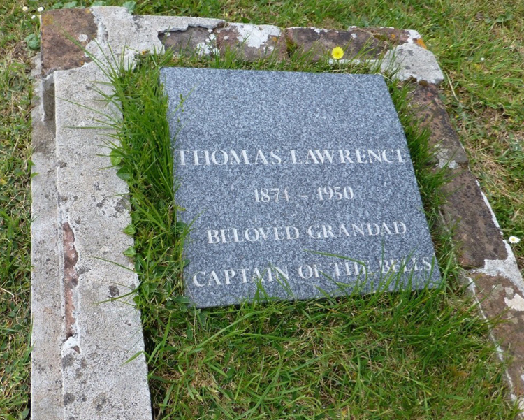

# Project Finance

“*How much is required and how do we raise the money?*” are often the first questions asked when a bell project is suggested. Most churches are short of money whether for routine expenses or for higher priority projects. However, bell projects usually attract donations and support from people who are not otherwise connected with the church, as well as from ringers and regular contributors. Donations may come from unexpected sources, unpredictably, often surprisingly quickly. Bell projects have long-lasting benefits and seem to appeal! 

## What is the Cost? 

The price of a bell project will be determined by the [work to be done](https://belfryprojects.cccbr.org.uk/docs/020-scoping-project/) and as [quoted]( https://belfryprojects.cccbr.org.uk/docs/070-contract-specification/) by the main contractor and sub-contractors. Very approximate costs may be indicated by looking at similar projects elsewhere. Additional items such as transport, protection for floors and church fabrics, disposal of surplus items, storage, hire of tools, may not be included in the main contracts. 

Price increases are inevitable, especially if the gestation period of the project is several months or years, and inflation rates are high. The bell trade recognises this and may quote a price that will be held for a specified period, but other prices may rise unpredictably. It is wise to add a percentage for genuine and unforeseen contingencies but guard this carefully!  It is not an excuse for poor estimating and planning!

## Money Management

The money raised will normally held by the Tower Authority, since the bells, fixtures and fittings are the property of the church. The Church Treasurer will be responsible for managing the money formally, but it is helpful for them to be assisted by a project treasurer. A separate fund should be set up within the PCC accounts for the project and this should be recorded in the PCC minutes. 


The details of setting up a ‘Project Fund’ (or even a fund for general tower activities) can be complicated. Steve Coleman considers this in a series of [articles on *Tower Funds in 2023*](#ringing-and-money) in *The Ringing World*.


Church of England PCCs are charities, but only those with incomes over a certain level need to register with the Charity Commission so smaller PCCs may not have a Registered Charity Number. This Charitable status offers certain benefits, such as tax savings. Other jurisdictions may have similar arrangements: In the USA, for example, most churches are 501(c)3 charities.

Only occasionally will a separate project fund be set up independent of church accounts, as a registered charity with its own Trustees. The Charity Commission publishes relevant documents on setting up and running a charity. The charity details should show that the money raised will be spent on the church bell project. It also needs to stipulate how any money will be used if there is a residue remaining after the project is complete. For example, it could be retained for future bell maintenance or transferred to another appropriate bell fund. Further advice is available online for [England and Wales](https://www.gov.uk/government/organisations/charity-commission) and for [Scotland](https://www.oscr.org.uk/).

Managing cash flow can be a challenge – with the risk of costs incurred exceeding funds raised at any time. This may arise when grant awarding organisations only pay on project completion. The project manager and treasurer will need to ensure that specific phases of the work can be financed before work commences and payments become due. 

The final payments on a contract should only be made after it is certain that all aspects of the contract are fully complete. A proportion of the contract value may be retained for a defined period after completion of the project for “snagging” (referred to in the USA as “completing the punch list”). This enables routine use of the bells for a period after which the bell hangers revisit the installation and make any minor adjustments necessary.


Steve Coleman has contributed a series of helpful articles entitled *Ringing and Money* to *The Ringing World*. A list of the references is included [below](#ringing-and-money).


## Schemes Offering Tax Benefits 

### Listed Places of Worship Grant Scheme

The [Listed Places of Worship (LPW) Grant Scheme](https://listed-places-of-worship-grant.dcms.gov.uk/) gives grants covering the VAT on repairs of over £1,000 to listed buildings used as places of worship. You can also submit one claim in any 12-month period that is less than £1,000, but more than £500. This is subject to detailed conditions and you will need to study the website carefully. Fortunately, Steve Coleman has an [article](#ringing-and-money) "*Avoiding the Dreaded VAT*"  which provides extensive guidance. Note that the web address quoted in the article has recently changed to the one given here.

### Gift Aid

[Gift Aid](https://www.gov.uk/donating-to-charity/gift-aid) increases the value of donations to the charity from individuals who are UK taxpayers. Higher rate taxpayers also benefit by the difference between the basic rate and higher rate of tax on their donation. The PCC Treasurer should be familiar with the operation of gift aid, and importantly, what donations may or may not be included as gift aided. *Note that to claim gift aid, the donor must not receive a "benefit”*.

Steve Coleman has several [articles](#ringing-and-money) on Gift Aid.

### Gift Aid Small Donations Scheme (GASDS) 

[This Scheme](https://www.churchofengland.org/resources/building-generous-church/enabling-giving/giving-mechanisms/gift-aid) is for small donations up to a total limit; the administration is more straightforward. Steve Coleman has two [articles](#ringing-and-money) “*GASDS – Gift Aid for Small Donations*” and “*GASDS and Parish Giving Scheme*”.

### Payroll Giving 

Some employees and recipients of taxed pensions may donate to charities tax-free. Employers will advise on how this operates and information on Payroll Giving can be found on the [HM Revenue & Customs website](https://www.gov.uk/payroll-giving).

### Charities Aid Foundation (CAF) Charity Card Account

The donor pays into the [account](https://www.cafonline.org/), CAF reclaim tax on behalf of the donor and add it to the account.  The card can then be used as a debit card to make individual donations to any registered charity, including small charities.

## Reducing Costs

Rather than donating cash, some organisations may lend or donate materials, tools or equipment, provide transport, tradesmen to undertake woodwork or painting. This must be with agreement of professional contractors involved.  

School and college students may design and help prepare publicity material, photographs and displays as part of projects, whether for history, music, technology, art. 

[Individuals and groups]( https://belfryprojects.cccbr.org.uk/docs/050-project-team/#team-supporters) may be willing to support the project using their skills and expertise. For example, a local photographic society may be willing to film and photograph the project. 

Local venues may offer to open their premises for events, or visits with the proceeds donated to the project fund. Visits to premises that are not normally open to the public may be particularly attractive, such as large and specialist gardens or workplaces. 

## Raising Money 

Fund raising for a specific project is normally led by members of the project team, in conjunction with the Tower Authority. The fund-raising campaign must inspire and enthuse potential donors. With electronic media, fund raising campaigns can be made to reach local, national and international audiences, so need to be tailored to reflect that. Appeals need to be refreshed periodically through well timed major events and smaller activities. 

### Initial launch 

The launch of the project should provide a stimulus for fund raising. A high-profile event can be an occasion to invite [prominent people](https://belfryprojects.cccbr.org.uk/docs/060-stakeholder-engagement) to hear about the project, its aims and how they may be able to support it and promote it.

### Donations 

Individuals and organisations may donate in response to a well-prepared appeal for money. Even with the widespread use of electronic media, experience shows that a well-presented leaflet distributed widely will generate positive response. Include a donation slip giving online bank details, postal address for cheques and online donation link.

Potential donors are likely to be more generous if they can identify their donation with something tangible. Letters to likely individuals and businesses should focus on their specific interests. 

### Crowd Funding 

This is a modern variant of traditional “public subscription” using online platforms. Ensure that a reputable, trustworthy system is selected.  

### Legacies 

Legacies, some substantial, have unexpectedly provided the stimulus for bell projects. Although a legacy cannot be assumed for any particular project, those writing their will may consider legacies to Bell Restoration Funds held by one of the [ringing societies](https://cccbr.org.uk/about/members/) or the [Central Council of Church Bell Ringers](https://cccbr.org.uk/cc-bell-ringing-fund/) itself. Steve Coleman has an [article](#ringing-and-money) "*Donating in Your Will*".

Donations may also be requested in memory of a deceased person in lieu of flowers. 

*Figure 1: Plaque commemorating a legacy donation*

Substantial donations from a legacy should be acknowledged publicly if possible (Figure 1).

### Sponsorship of specific items 

Sponsoring a new bell is popular as it is a very tangible and lasting item. A bell may be cast with a brief inscription suggested by donor. 

Consider whether larger donations could be invited to cover the cost of not only the bell itself but also its headstock, wheel, bearings, clapper, and even sections of the bell frame. In this way, funds are raised for some of the “less attractive” but essential items. Alternatively, individuals and families may be willing to sponsor component parts (for example, wheels, iron and steelwork), and these may be either marked with the donor’s name or the donation recorded on a suitable record board.  

Local companies and organisations may make donations as part of their Corporate Social Responsibility, especially if aspects of the project are made to align with their business. 

### Loans 

These may help [cash flow](https://belfryprojects.cccbr.org.uk/docs/040-managing-project/#money-management).  When interest rates are low, a loan “costs” the lender little, but with higher interest rates the “cost” to the lender may become more significant, effectively an additional donation. A loan should be accompanied by formal agreement of the terms on which the loan is made.

Some bell ringing societies maintain bell restoration funds (often registered charities) and the terms of these funds may permit interest free loans. 

### Volunteer time 

Keep a record of time spent by volunteers on the project. This may be accounted as equating to financial contributions to the project by some grant awarding bodies. The record can also provide evidence of the commitment and enthusiasm of many people, a clear demonstration that the project is not one individual’s hobby. 

### Events

Events take a lot of planning, hard work and effort and do not necessarily raise income in proportion. Their use is discussed in the [Addendum](../060-stakeholder-engagement/engagement-ideas/) to Stakeholder Engagement.

### Sales

Some funds may be raised from sales,  or auctions of donated items on a pre-defined basis of sharing proceeds. The prominence of online sale and auction websites has reduced the attraction of such events. If buying items to sell at a profit, be very cautious about the choice of items - yet another set of engraved wine glasses or dusty ornaments may not be just the reminder everyone wants to buy! Something related to the church may be more attractive: Figure 1 shows a wooden bowl turned up by a local craftsman from an old beam removed (with permission) from the tower as part of a rehanging project. 

*Figure 2: Wooden bowl turned from an old beam*

### Souvenirs

Volunteers may produce a booklet for sale, giving a history of the bells in the context of the church and the proposed project. The material included may be redeployed from what is also used on display boards, in grant applications, talks and presentations. Offers of help may be sought from outside the church and local ringers – for example local history groups, artists, photographers and designers. 

### Auction of promises 

People offer goods or services, with the winning amounts donated to the funds. The promises could range widely: From a ride as passenger on a fast motorbike to a conducted tour around the private rooms of the local stately home.

## Applying for Grants

Grants often contribute a large proportion of money to be raised. However, the success rate can be very disappointing (typically found to be about 1 in 3) especially after spending time gathering information and drafting forms. Some funders publicise their typical success rates and this may be a consideration when devoting time to preparing an application. 

There are relatively few funders focused solely on bell projects, but you may be eligible for other schemes if the aims and outcomes are designed to fit with the criteria set by the funder. In some cases, it is the requirements of funders that lead to the generation of additional ideas that lead to even more successful projects! 

### Where to find information 

There is a vast volume of information available online but also in public libraries and local community organisations. Spend time researching, discussing with the project team and browsing for ideas. 

Take time to find out about likely funders and read their requirements carefully. Grant awarding bodies usually have defined criteria for their awards and many only accept applications at certain times. For each application, read all the criteria, follow the guidance and requirements exactly. Each request must be customised to show how it will fulfil the aims and outcomes of the funder but fitting the success criteria. Time spent preparing will pay off! 

Funders may be willing to discuss specific points with the project leader. However, before making contact make sure that the points are not explained in information that is openly available. 

Try to find similar projects that have been funded by the organisation previously as it may be possible to contact those who received support and learn from their experiences.

Some funders make a certain number of awards periodically. For example, if a funder  distributes £100,000 each year and states that they normally support 10 projects, then this hints that a request for about £8,000 - £12,000 will be the most a single project can expect to receive. 

Some funders will expect to see a considerable sum raised through “self-help” before they consider making a grant, while others will see that funds already raised give the impression that their support is unnecessary.

### Potential sources of grants


The list of sources below may not be exhaustive. Please contact smSec@cccbr.org.uk with any comments, corrections or suggested additions.


Most ringing societies have funds available for bell projects. Contact your [local society](https://cccbr.org.uk/about/members/) for details.

The Central Council of Church Bell Ringers has two funds which may be able to offer grants:
 - The Central Council [Bell Restoration Fund](https://cccbr.org.uk/cc-bell-ringing-fund/) generates income  primarily from legacies, donations, fundraising offers and bank interest. When funds are available, applications for grants are invited by notices in *The Ringing World*, on the CCCBR website, and on other communications channels.
 - The [Fred E Dukes International Bell Fund](https://cccbr.org.uk/dukes-international-fund/) is a capital fund and grants can only be paid from the interest earned, which limits the size of grants. Under the terms of the fund, grants are paid only for work carried out by UK bell founders and UK bell-hangers on bell restoration projects in countries outside the UK and Ireland. Applications for grants from the Fund are invited each year by a notice in *The Ringing World*, on the CCCBR website and by notification to ringing organisations outside the British Isles.

The following national organisations may be willing to offer financial support for bell related projects:

[PARISH RESOURCES](https://www.parishresources.org.uk/wp-content/uploads/Bells-Windows-Organs-Other-Specific-Funding.pdf) An extensive website with a wealth of information, not just about grants! This site includes links to some of those listed below.

[THE BARRON BELL TRUST](https://www.nationalchurchestrust.org/barron-bell-trust). Preference is given to churches where the services are Low Church. Do not apply until at least 50% of money has been raised. Preference is given for applications where there is an intention to increase the number of bells to at least six.

[CHURCHCARE](https://www.churchofengland.org/more/church-resources/churchcare/our-conservation-grants). Mainly gives grants for ancient bells and bells of historic interest, repairs to listed frames and bells.

[THE SHARPE TRUST](http://sharpetrust.org.uk). Supports maintenance and restoration of bells in England and Wales.

[KELTEK TRUST](https://www.keltektrust.org.uk). The Trust helps churches to locate and acquire second-hand bells. The Trust also helps those wishing to dispose of surplus and redundant bells.

[HERITAGE LOTTERY FUND](https://www.hlf.org.uk). The fund has made grants for bell restoration particularly where the bells are listed for preservation and/or the original bell frame has been kept in use. Grants are not given for new rings of bells or recasting existing bells. The HLF has a variety of programmes which might suit a project if it has a heritage angle. Application can be made for ALL HLF programmes but bear in mind that they are very keen that heritage is the key aspect of the project and will want to see good community involvement.

[GARFIELD WESTON FOUNDATION](https://garfieldweston.org/). Particularly interested in projects that demonstrate community involvement.

[BENEFACT TRUST](https://benefacttrust.co.uk/). Provides essential support to protect and enhance churches and Christian charity buildings.

[LISTED PLACES OF WORSHIP GRANT SCHEME](https://www.lpwscheme.org.uk/grant_scheme.html). This scheme applies only to repairs, maintenance and alteration works to listed buildings that are used principally as places of worship and listed places of worship owned by or vested in a number of specified organisations which look after redundant places of worship.

[NATIONAL CHURCHES TRUST]( https://www.nationalchurchestrust.org/). Their website states “Every year we help hundreds of churches, chapels and meeting houses to stay open, helping to save precious heritage and keeping churches at the beating heart of local communities.”

[LANDFILL COMMUNITIES FUND]( https://www.entrust.org.uk/landfill-community-fund/). The Landfill Communities Fund (LCF) is an innovative tax credit scheme enabling operators of landfill sites in England and Northern Ireland to contribute money to organisations enrolled with ENTRUST as Environmental Bodies (EBs). Their “Object E” covers the restoration of a place of religious worship or of historic or architectural interest.

[ECCLESIASTICAL]( https://www.ecclesiastical.com/church/fundraising/) (the insurer of many churches) has a fundraising hub providing easy-to-use support, guidance and tools to help you and your church with fundraising now and into the future.

[HISTORIC ENGLAND](https://historicengland.org.uk/services-skills/grants/our-grant-schemes/) offers repair grants for historic sites at risk of being lost.

[CADW](https://cadw.gov.wales/advice-support/historic-assets/listed-buildings/historic-buildings-grant) offers maintenance and repair grants for historic buildings in Wales.

LOCAL AUTHORITIES. A Church of England [Press
Release](https://www.churchofengland.org/media-and-news/press-releases/legislation-clarifying-right-local-authorities-support-churches)
in September 2023 announced that legislation clarifying that parish and
town councils **within England** can provide support to churches for
repairs and improvements has cleared its final stages in the House of
Lords. A Government amendment to the Levelling Up Bill makes it clear
that local authorities can provide grants for parish churches or places
of worship, following many years of legal uncertainty. Further
background is given on the [Historic Religious Buildings
website.](https://www.hrballiance.org.uk/consultations-2/consultations/local-councils/#:~:text=Over%20the%20years%2C%20many%20Parish,provide%20benefit%20to%20the%20community)

Also consider grant awarding bodies in the relevant local area. For example, in the Birmingham area, the [Heart of England Community Foundation](https://www.heartofenglandcf.co.uk).

Many dioceses produce their own funding guides and advice on projects. For example: 

 -	[Bristol](https://www.bristol.anglican.org/fundraising/)
 -	[Hereford](https://www.hereford.anglican.org/parish-support/community-partnership/crossing-the-threshold-toolkit/)  

### Preparing applications 

Most grant awarding bodies will expect to see clear plans with realistic estimates of costs and will expect to be reassured that there is reasonable certainty that the project will proceed to completion in the planned timescale.

It is preferable for someone to lead the preparation of grant requests who has previous experience of successful bid writing and has a strong commitment to the project’s success. They will be better placed to understand and follow the guidance provided by the funders.  The completed documentation will still have to be agreed and signed by the PCC Treasurer, even though they may not have prepared it.

Professional bid writers offer to prepare grant applications for a fee. However, grant awarding bodies recognise that such people do not offer a long-term commitment to the project or become part of the team maintaining activities in the longer term. Some grant awarding bodies will not accept applications by professional bid writers.


If you are very lucky, a member of your band may be a professional bid writer who will do it for free!


Always customise the information presented for the application being made. Although similar information may well be requested by different organisations, make sure that each response is relevant. Copying information may save time but check everything carefully – it is so easy for a tell-tale point to remain visible in a later application. If there is a word limit, then keep to it. If religious activities are not supported consider whether a bell project in a church tower would be acceptable. 

Vague or unfocused requests are unlikely to be supported. Few organisations will respond to what is clearly a bland request for money. Make your application stand out in a positive way! Reviewers of a large bundle of applications soon grow weary of unclear and poorly presented information. Those reviewing applications will find it easier to recall and refer to an application that stands out for its clarity, what it aims to achieve and how it complies with the funder’s interests. It is inadvisable, however, to make stand out in an extreme way as this may irritate some reviewers. 

The history of the bells and their installation along with the lives of people who have rung them (Figure 2) adds human and personal stories and is likely to enhance the case when requesting permission,  particularly in the context of what items may be removed, preserved or altered. Such information will also be of considerable interest for members of the local community; local historians, school and college students may be able to undertake their own research and provide additional information that puts the project in context for the past and for the future, which is history in the making, for the next few hundred years!

*Figure 3: The names on a tombstone - are there still local families in the area?*

### Why are applications not supported? 

Funds are limited so regrettably not all grant requests will be accepted. A rejection does not mean that the project is not worthwhile, even though every rejection is a great disappointment! 

Some organisations will provide feedback on grant applications. Was the application non-compliant or did it not fit the criteria well enough? Was it incomplete or unclear? 


**TOP TIP** Customise funding requests to meet each recipient’s criteria and interests.


The [National Churches Trust](https://www.nationalchurchestrust.org/get-support/grants) has provided the following top tips for applying for grant money which may be useful in any grant application:
-	**Be specific in your application**. Include facts, figures, details and an explanation of the tangible benefits of your project. Explain the value you already add to the church community.
-	**Lead with the need**. Emphasise the urgency and importance of the need for funding. This is where surveys, reports and consultations can support your application. 
-	**Include all necessary documents**. Ensure that you have gathered quotations, accounts and necessary permissions in writing and submitted a complete set of documentation with your initial application. 
-	**Have your application checked by an expert**. Before you submit your paperwork, ask someone outside the project to check it for anything that might be missing, unclear or conflicted. A church architect, churchwarden, diocesan bells adviser, or a fundraiser with successful experience can all provide valuable advice. 
-	**Celebrate your successes**. Highlight the fundraising you have already done. Demonstrate positive achievements. Express thanks to major donors and pledges. 

## Ringing and Money

Steve Coleman has published a series of articles in *The Ringing World* under the heading of *Ringing and Money*. These provide valuable additional information for several aspects of Project Finance and the references to the articles are given below.


A subscription is required for access to articles in *The Ringing World*. If necessary, a local ringer or your local ringing Society or Association should be able to help.


| Title | Issue | Date | Page |
| ---- | :----: | :----: | :----: |
| Gift Aid in 2023 | 5831  | 27 January 2023 | 76 |
| Gift Aid – The Simple Wheezes | 5833 | 10 February 2023 | 124 |
| Gift Aid – The Complicated Wheezes | 5835 | 24 Feb 2023 | 166 |
| Gift Aid – What *doesn’t* Count | 5837 | 10 March 2023 | 213 |
| GASDS – Gift Aid for Small Donations | 5839 | 24 March 2023 | 277 |
| Donating in Your Will | 5841 | 7 April 2023 | 306 |
| GASDS and Parish Giving Scheme | 5844 | 28 April 2023 | 376 |
| Avoiding the Dreaded VAT | 5853 | 30 June 2023 | 660 |
| Tower Funds in 2023 | 5862 | 1 September 2023 | 851 |
| How Tower Funds Waste Money | 5865 | 22 September 2023 | 927|
| Where to put a Tower Fund | 5868 | 13 October 2023 | 998 |
| Transferring a Tower Fund | 5873 | 17 November 2023 | 1121 |
| Tower Funds, Ringing Societies and Tax | 5877-9 | 15-29 December 2023 | 1228 |
| Tower Funds and Ringing Societies – When Tax is Due | 5888 | 1 March 2024 | 188 |
| Ringing Societies and Tower Funds: Registering as Charities | 5915 | 6 September 2024 | 825 |
| Running a Ringing Charity | 5930-32 | 20 / 27 Dec 2024 / 3 Jan 2025 | 1203 |

## Image Credits

| Figure | Details | 
| :---: | --- |
| Title | Bell project at Great Malvern Priory © Simon Mellor |
| 1 | Plaque in ringing room at Malvern Priory acknowledging a legacy donation. (Photo: Alison Hodge) |
| 2 | Wooden bowl turned from an old oak beam removed during a rehanging project. (Photo: Robin Shipp) |
| 3 | Ringer's name on a tombstone. (Photo: Alison Hodge) |

----


**[Previous Chapter](../070-contract-specification/)** - **[Next Chapter](../100-regulations-compliance/)**


----

## Disclaimer
 
*Whilst every effort has been made to ensure the accuracy of this information, neither contributors nor the Central Council of Church Bell Ringers can accept responsibility for any inaccuracies or for any activities undertaken based on the information provided.*

Version 1.2.2, February 2025

© 2024 Central Council of Church Bell Ringers
