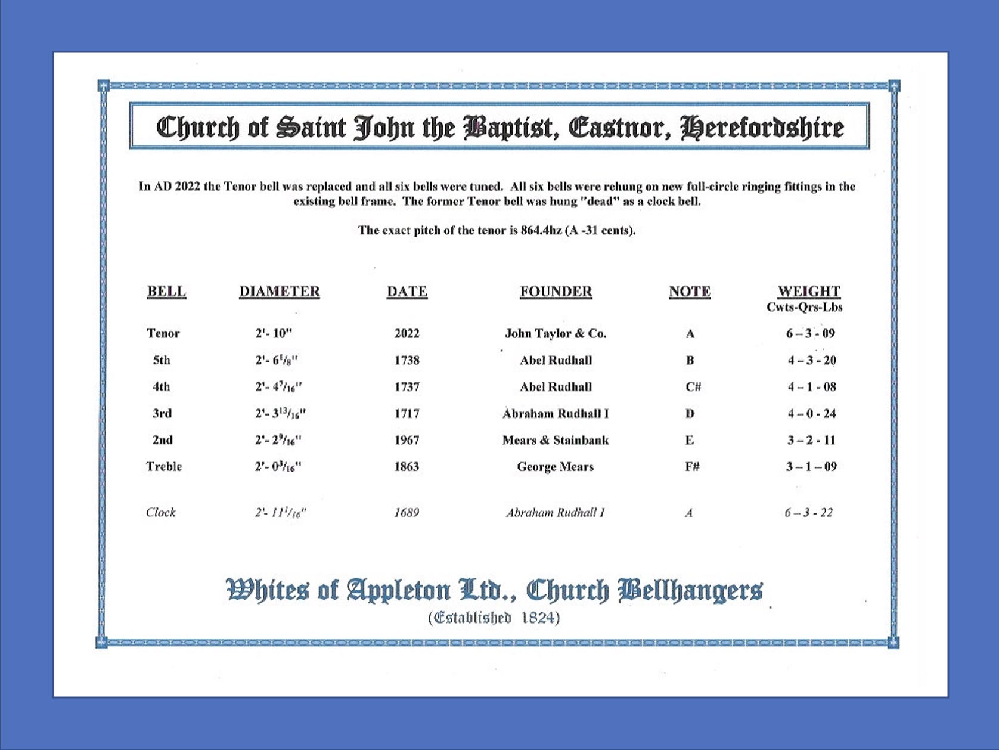
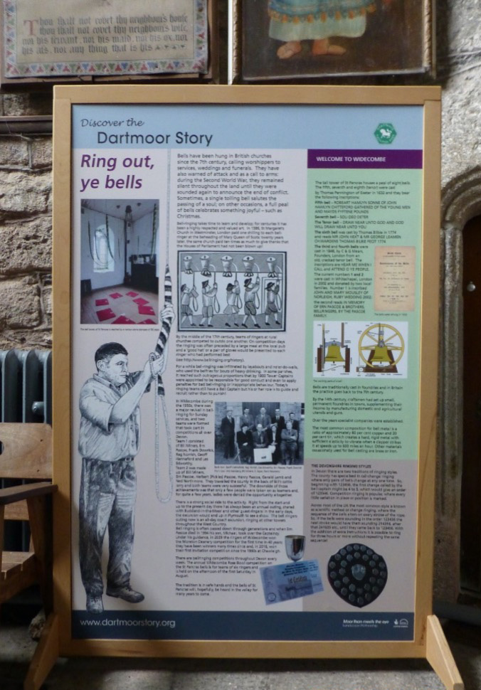

# Project Completion

After many months and often years of hard work, with disappointments and excitements on the way, the project will be completed successfully! 

## Resuming RInging

Since ringing will be resuming, it will be timely to alert neighbours of the completion of the work and advise them of likely ringing times for the regular services and practices. They are more likely to understand and be tolerant if they know in advance when ringing will occur, especially anything that is out of the ordinary. Include an invitation to see ringers in action and what is involved; this is an opportunity for recruiting new ringers.

*Figure 1: Permanent display board about bell ringing in a church*

Publicise ringing more widely in local media. Make sure there is a notice in the church porch giving time of ringing - a customisable pdf can be downloaded [here](https://cccbr.org.uk/wp-content/uploads/2018/03/Tower_Porch_Notice_Customisable.pdf). Consider display boards in the church (Figure 1).

## Completing the Paperwork

Complete the records about the project, file and store them safely. Make the final entries in a project blog and dossier about the project.  

The final bills should be paid, accounts reconciled and copies prepared for sponsors. Include a letter of thanks when saying that the work has been completed, along with any reports required. Aim to make these as personal and specific as possible; include a copy of a summary brochure that shows the culmination of the whole project. Some funders may require reports about the consequences of the project after an interval of several years, so ensure that records are collected, analysed and submitted by the dates due.

## Follow-up Work

Even though the project is complete, remember that there may be a defined period for “snagging” and perhaps the bell hangers include a check of the installation after a period of use, a year for example. Put these in the diary and remember to follow them up. If any problems are spotted, then make sure that these are noted and attended to before the time period expires. 

## Saying “Thank You”

For many projects it will be appropriate to hold a celebratory event to say “thank you” to everyone involved. After all the hard work, the completion of the project and conclusion of formalities will be a relief but there will be challenges ahead not least of which will be the attraction, training and retention of ringers so remember that completion of the project is the end of the beginning not the end!  

## Image Credits

| Figure | Details | 
| :---: | --- | 
| Title Picture | Framed certificate showing work completed on a bell project (Whites of Appleton) |
| 1 | Permanent display board about bell ringing in a church (Photo:  Alison Hodge) |

----


**[Previous Chapter](../100-regulations-compliance/)** - **[Next Chapter](../115-specialists/)**


----

## Disclaimer
 
*Whilst every effort has been made to ensure the accuracy of this information, neither contributors nor the Central Council of Church Bell Ringers can accept responsibility for any inaccuracies or for any activities undertaken based on the information provided.*

Version 1.0, May 2023

© 2023 Central Council of Church Bell Ringers
